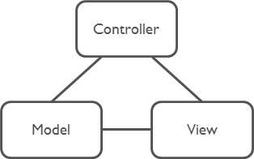
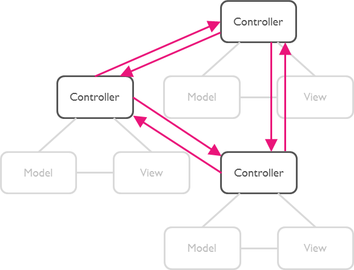
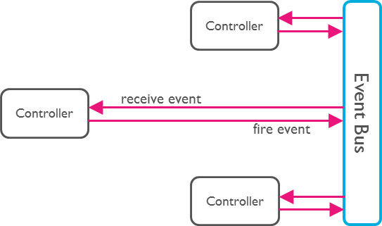

+++
title = "Dart Event Bus"
date = 2014-03-25
updated = 2019-12-05
image = "event-bus.png"
description = "An Event Bus library in Dart for decoupling applications."
prettify = true
comments = true

# Series Overview Info
overview = true
overviewImage = "event-bus-small.png"
overviewDescription = "An Event Bus library in Dart for decoupling applications."
topics = [ "Dart" ]
weight = 9

[[sidebars]]
header = "Source Code"

[[sidebars.items]]
text = "<i class=\"fa fa-fw fa-github-alt\"></i> Source on GitHub"
link = "https://github.com/marcojakob/dart-event-bus"

[[sidebars.items]]
text = "<i class=\"fa fa-fw fa-download\"></i> Package on Pub"
link = "https://pub.dartlang.org/packages/event_bus"
+++

A simple Event Bus using Dart [Streams](https://api.dartlang.org/apidocs/channels/stable/dartdoc-viewer/dart:async.Stream) 
for decoupling applications.


***

## Demo

<iframe src="https://marcojakob.github.io/dart-event-bus/" width="100%" height="420px"></iframe>

***


## Event Bus Pattern

An Event Bus follows the publish/subscribe pattern. It allows listeners to 
subscribe for events and publishers to fire events. This enables objects to
interact without requiring to explicitly define listeners and keeping track of
them.


### Event Bus and MVC

The Event Bus pattern is especially helpful for decoupling [MVC](https://wikipedia.org/wiki/Model_View_Controller) 
(or [MVP](https://wikipedia.org/wiki/Model_View_Presenter)) applications.

**One group of MVC** is not a problem.



But as soon as there are **multiple groups of MVCs**, those groups will have to talk
to each other. This creates a tight coupling between the controllers.



By communication through an **Event Bus**, the coupling is reduced.




## Usage

### 1. Create an Event Bus

Create an instance of `EventBus` and make it available to other classes.

Usually there is just one Event Bus per application, but more than one may be 
set up to group a specific set of events.

<pre class="prettyprint lang-dart">
import 'package:event_bus/event_bus.dart';

EventBus eventBus = EventBus();
</pre>

**Note:** _The default constructor will create an asynchronous event bus. To
create a synchronous bus you must provide the optional `sync: true` attribute._


### 2. Define Events

Any Dart class can be used as an event.

<pre class="prettyprint lang-dart">
class UserLoggedInEvent {
  User user;

  UserLoggedInEvent(this.user);
}

class NewOrderEvent {
  Order order;

  NewOrderEvent(this.order);
}
</pre>


### 3. Register Listeners

Register listeners for a **specific events**: 

<pre class="prettyprint lang-dart">
eventBus.on<UserLoggedInEvent>().listen((event) {
  // All events are of type UserLoggedInEvent (or subtypes of it).
  print(event.user);
});
```

Register listeners for **all events**:

```dart
eventBus.on().listen((event) {
  // Print the runtime type. Such a set up could be used for logging.
  print(event.runtimeType);
});
</pre>


#### About Dart Streams

`EventBus` uses Dart [Streams](https://api.dartlang.org/apidocs/channels/stable/dartdoc-viewer/dart:async.Stream)
as its underlying mechanism to keep track of listeners. You may use all 
functionality available by the [Stream](https://api.dartlang.org/apidocs/channels/stable/dartdoc-viewer/dart:async.Stream)
API. One example is the use of [StreamSubscriptions](https://api.dartlang.org/apidocs/channels/stable/dartdoc-viewer/dart:async.StreamSubscription)
to later unsubscribe from the events.

<pre class="prettyprint lang-dart">
StreamSubscription loginSubscription = eventBus.on<UserLoggedInEvent>().listen((event) {
  print(event.user);
});

loginSubscription.cancel();
</pre>


### 4. Fire Events

Finally, we need to fire an event.

<pre class="prettyprint lang-dart">
User myUser = User('Mickey');
eventBus.fire(UserLoggedInEvent(myUser));
</pre>


## Using Custom Stream Controllers

Instead of using the default `StreamController` you can use the following constructor
to provide your own.

An example would be to use an [RxDart](https://pub.dartlang.org/packages/rxdart) Subject
as the controller.

<pre class="prettyprint lang-dart">
import 'package:rxdart/rxdart.dart';

EventBus behaviorBus = EventBus.customController(BehaviorSubject());
</pre>


## Download

<i class="fa fa-fw fa-github-alt"></i> [Source on GitHub](https://github.com/marcojakob/dart-event-bus)

<i class="fa fa-fw fa-download"></i> [Package on Pub](https://pub.dartlang.org/packages/event_bus)
