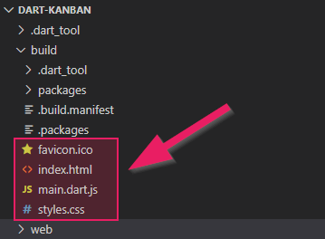

+++
title = "Teil 5: Veröffentlichen"
date = 2015-03-23
updated = 2020-05-05
image = "dart-kanban.png"
description = "Die Dart Applikation nach JavaScript übersetzen. Den generierten Build-Ordner auf einem Webserver veröffentlichen."
prettify = true
comments = true
commentsIdentifier = "/library/dart-kanban/de/part5/"
aliases = [ 
  "/library/dart-kanban/de/part5/" 
]

pagingName = "5"
weight = 6

[[sidebars]]
header = "Source Code"

[[sidebars.items]]
text = "<i class=\"fa fa-fw fa-github-alt\"></i> Beispielcode auf GitHub"
link = "https://github.com/marcojakob/tutorial-dart-kanban"
+++

Wenn man eine coole App mit Dart programmiert hat, dann möchte man diese natürlich auch veröffentlichen.

## Dart nach JavaScript übersetzen

Damit alle Browser unser Programm verstehen, müssen wir es nach JavaScript übersetzen lassen. 

Öffne das Terminal (**View | Terminal**) und gib folgende Befehle ein:

`webdev build`

Dann dauert es ein paar Sekunden und ein neuer Ordner mit Namen `build` wird erstellt mit dem übersetzten JavaScript.

    <strong>Zum Beenden von <code>webdev serve</code>:</strong> Wenn bei dir noch der Webserver läuft, so nutze die Tastenkombination <kbd>Ctrl+C</kbd> im Terminal, um diesen zu beenden (geht für alle Prozesse, die im Terminal laufen).

## Der Build Ordner

Im generierten `build`-Ordner befinden sich nun all die Dateien, die wir brauchen, um unser Programm auf einen Webserver zu stellen.

## Veröffentlichen (Deployment)

Wir können den ganzen `build` Ordner genau so auf einen beliebigen Webserver hochladen. Da unser ganzes Programm im Browser auf dem Client läuft, haben wir keine speziellen Anforderungen an den Server.

### Hostingmöglichkeiten

Im [HTML & CSS Tutorial Teil 2](/de/library/html-css/part2/) habe ich Möglichkeiten beschrieben, wie man eine Website gratis oder sehr günstig hosten lassen kann. Alle Hosting-Anbieter können verwendet werden für unsere Dart-Programme.

Eine speziell einfache Variante ist Netlify (und erst noch gratis): Einfach die Dateien per Drag-and-Drop in den (Chrome) Browser ziehen und schon ist die Seite live. Dies funktioniert mit [Netlify drop](https://app.netlify.com/drop) sogar ohne Login!

## Wie weiter?

Erfahre in [nächsten Schritte](/de/library/dart-kanban/next/) wie du das Kanban Board weiterentwickeln kannst.

