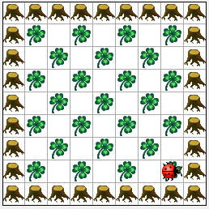
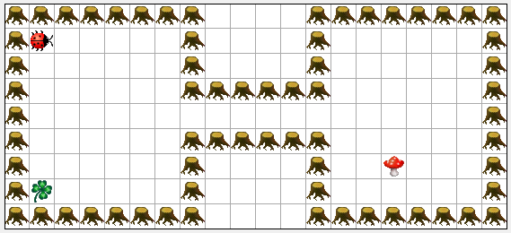
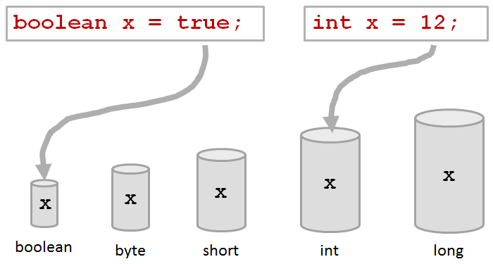

+++
title = "Chapitre 3: Variables"
date = 2014-07-10
image = "greenfootkara-screenshot.png"
description = "Pour résoudre des problèmes difficiles en programmation, il est souvent utile de représenter graphiquement la succession de tâches à l'aide d'un diagramme simple."
prettify = true
comments = true
commentsIdentifier = "/library/greenfoot-kara/fr/chapter3/"
aliases = [ 
  "/library/greenfoot-kara/fr/chapter3/" 
]

pagingName = "3"
weight = 4

[[sidebars]]
header = "Solutions"
[[sidebars.items]]
text = "<i class=\"fa fa-fw fa-check-square-o\"></i> Solutions Chapitre 3"
link = "/fr/library/greenfoot-kara/chapter3/solutions/"

[[sidebars]]
header = "Downloads"
[[sidebars.items]]
text = "<i class=\"fa fa-fw fa-file-archive-o\"></i> scenarios-chapter-3.zip"
link = "https://github.com/marcojakob/greenfoot-kara/releases/download/v2.1.1/scenarios-chapter-3.zip"
[[sidebars.items]]
text = "<i class=\"fa fa-fw fa-file-word-o\"></i> Page en fichier Word"
link = "/library/convert-web-page-to-word/"
+++

Au chapitre précédent, nous avons appris à répéter certaines actions tant qu'une condition est remplie. Maintenant notre objectif est de réaliser que :

*Kara positionne une suite de 5 feuilles en ligne.*

 

Evidemment ce serait très facile si on faisait appel à `putLeaf()` et `move()` cinq fois successivement. Mais ce n'est pas une façon de coder très élégante. Ce qui serait bien, c'est que Kara compte combien de feuilles elle a déjà placées.  Pour cela, Kara a besoin d'un "cerveau",  c.à d. une sorte de mémoire.  En informatique on utilise la mémoire à l'aide de variables.

### Kara sait compter

<pre class="prettyprint lang-java">
int i;
i = 0;

while (i &lt; 5) {
	putLeaf();
	move();

	i = i + 1;
}
</pre>

#### Explanations

1. Avec `int i;`  Nous réservons un espace mémoire que nous appelons `i` qui pourra stocker une valeur de *type entier*. On dit que l'on **déclare la variable i**. En Java, il existe différents types de varia-bles qui peuvent être utilisés (cf. les tableaux, plus bas).
2. Avec `i = 0;` on affecte à la variable `i` la valeur `0`. Comme c'est la première affectation pour cette variable, on dit qu'on **initialise la variable i**.
3. On peut déclarer et initialiser une variable en une seule ligne : `int i = 0;`
4. Pour la condition condition `i < 5`, l'opérateur de comparaison `<` signifie inférieur à (cf. les tableaux ci-dessous pour les autres opérateurs de comparaison).
5. Pour l'affectation `i = i + 1`, nous devons d'abord examiner la partie droite. Cela signifie : "prends la valeur courante de `i`, ajoute `1` à cette valeur et sauvegarde le résultat en remplaçant la valeur de `i`."

#### Informations complémentaires à propos des Variables

* Il est possible de donner à une variable une valeur intangible, c.à d. d'en faire une constante : `final int NUMBER = 5;`   
Nous aurions pu alors écrire l'exemple précédent :  `while (i < NUMBER)`   
Le nom des constantes est écrit complétement en lettres majuscules.
* Le nom des variables qui ne sont pas des constante commence toujours par une lettre minuscule.

***

## Types de données élémentaires ou primitifs en Java

Ces types de données sont appelés "élémentaires" ou "primitifs" car ce sont les types de base en Java. (Plus tard nous apprendrons à créer de types de variables pour des objets).

### Entiers et Caractères

<table class="table table-bordered">
  <thead>
    <tr>
      <th>Type</th>
      <th>Depuis la valeur</th>
      <th>Jusqu'à la valeur incluse</th>
      <th>Memoire nécessaire</th>
    </tr>
  </thead>
  <tbody>
    <tr>
      <td><code>byte</code></td>
      <td>-128</td>
      <td>127</td>
      <td>8 bit</td>
    </tr>
    <tr>
      <td><code>short</code></td>
      <td>-32'768</td>
      <td>32'767</td>
      <td>16 bit</td>
    </tr>
    <tr>
      <td><code>int</code></td>
      <td>-2'147'483'648</td>
      <td>2'147'483'647</td>
      <td>32 bit</td>
    </tr>
    <tr>
      <td><code>long</code></td>
      <td>-9'223'372'036'854'775'808</td>
      <td>9'223'372'036'854'775'807</td>
      <td>64 bit</td>
    </tr>
    <tr>
      <td><code>char</code></td>
      <td>0</td>
      <td>65'635</td>
      <td>16 bit</td>
    </tr>
  </tbody>
</table>

### Nombres à virgule flottante

<table class="table table-bordered">
  <thead>
    <tr>
      <th>Type</th>
      <th>Depuis la valeur</th>
      <th>Jusqu'à la valeur incluse</th>
      <th>Memoire nécessaire</th>
    </tr>
  </thead>
  <tbody>
    <tr>
      <td><code>float</code></td>
      <td>-3.4 \* 1038</td>
      <td>3.4 \* 1038</td>
      <td>32 bit</td>
    </tr>
    <tr>
      <td><code>double</code></td>
      <td>-1.7 \* 10308</td>
      <td>1.7 \* 10308</td>
      <td>64 bit</td>
    </tr>
  </tbody>
</table>

### Valeurs logiques

<table class="table table-bordered">
  <thead>
    <tr>
      <th>Type</th>
      <th>Fourchette de valeurs</th>
      <th>Memoire nécessaire</th>
    </tr>
  </thead>
  <tbody>
    <tr>
      <td><code>boolean</code></td>
      <td><code>true</code> ou <code>false</code></td>
      <td>1 bit</td>
    </tr>
  </tbody>
</table>

***

## Opérateurs de Comparaison

Les opérateurs suivants peuvent être utilisés pour comparer dans Java. Le résultat est toujours un boolean (soit `true` ou `false`).

<table class="table table-bordered">
  <thead>
    <tr>
      <th>Opérateur</th>
      <th>Signifie</th>
      <th>Exemple</th>
    </tr>
  </thead>
  <tbody>
    <tr>
      <td><code>==</code></td>
      <td>égal (deux signes = accolés)</td>
      <td><code>k == 2</code></td>
    </tr>
    <tr>
      <td><code>!=</code></td>
      <td>différent de</td>
      <td><code>k < 12</code></td>
    </tr>
    <tr>
      <td><code>></code></td>
      <td>strictement supérieur à</td>
      <td><code>k > 67</code></td>
    </tr>
    <tr>
      <td><code><</code></td>
      <td>strictement plus petit que</td>
      <td><code>k < 12</code></td>
    </tr>
    <tr>
      <td><code>>=</code></td>
      <td>supérieur ou égal à</td>
      <td><code>k >= 45</code></td>
    </tr>
    <tr>
      <td><code><=</code></td>
      <td>plus petit ou égal à</td>
      <td><code>k <= 23</code></td>
    </tr>
  </tbody>
</table>

**Note:** Le signe de comparaison de l'égalité est toujours constitué de deux signes égal `==`. Le signe égal tout seul `=` est utilisé pour les affectations !

***

## Opérateurs Arithmétiques

Pour calculer nous utilisons les opérateurs arithmétiques suivants :

<table class="table table-bordered">
  <thead>
    <tr>
      <th>Opérateur</th>
      <th>Signification</th>
      <th>Exemple</th>
    </tr>
  </thead>
  <tbody>
    <tr>
      <td><code>+</code></td>
      <td>Addition</td>
      <td><code>h = value + 34</code></td>
    </tr>
    <tr>
      <td><code>-</code></td>
      <td>Soustraction</td>
      <td><code>y = 3.4 – t</code></td>
    </tr>
    <tr>
      <td><code>*</code></td>
      <td>Multiplication</td>
      <td><code>z = h * 3.56</code></td>
    </tr>
    <tr>
      <td><code>/</code></td>
      <td>Division</td>
      <td><code>d = m / v</code></td>
    </tr>
    <tr>
      <td><code>%</code></td>
      <td>Modulo (donne seulement le **reste** de la Division)</td>
      <td><code>count = w % 2</code></td>
    </tr>
  </tbody>
</table>

***

#### <i class="fa fa-rocket"></i> TÂCHE 3.01 : Compter les feuilles

 

Kara se déplace horizontalement de la gauche vers la droite jusqu'à l'arbre en comptant les feuilles.

*Notes:*

* À la fin, on peut afficher le résulat sur la console avec la commande suivante : `System.out.println("The result is: " + count);`
* Un texte doit toujours être écrit entre guillemets. Le signe + sert à ajouter la valeur de la variable `count` (qui bien sûr aurait pu être nommée différemment).
* *Portée des variables* : les variables locales sont visibles seulement dans le bloc (c.à d. entre les accolades), à l'intérieur desquelles elles ont été déclarées ; et leur durée de vie est limitée à la durée de l'exécution de la méthode qui les porte. Quand elles sont déclarées en-dehors d'une méthode, au niveau de la classe elles sont visibles quel que soit l'endroit de la classe et pour la durée d'utilisation de la classe ; elles sont appelées **champs** ou **attributs** ou **variables d'instance**.

#### <i class="fa fa-rocket"></i> TÂCHE 3.02 : Kara das une boite I

 

Une surface carrée est délimitée par des arbres. À l'intérieur de cet espace un ensemble de feuilles est disposé que Kara va devoir inverser. Kara démarre du coin supérieur gauche et regarde vers la droite.

*Aide:*

* Pour cette tâche,Il est pratique d'utiliser des variables booléennes, c.à d.:
  * déclaration et initialisation : `boolean goingRight = false;`
  * permuter de "true" à "false" et vice versa : `goingRight = !goingRight;`
  * booléen utilisé comme condition : `if (goingRight)`

#### <i class="fa fa-rocket"></i> TÂCHE 3.03 : Kara das une boite II

 

Une surface carrée est délimitée par des arbres. Dans cet espace Kara doit réaliser un damier de feuilles. Kara démarre du coin supérieur gauche et regarde vers la droite.

#### <i class="fa fa-rocket"></i> TÂCHE 3.04 (difficile) : La plus longue ligne d'arbres

 

Dans notre monde Il ya plusieurs colonnes d'arbres. Kara doit déterminer la longueur (en nombre d'arbres) de la colonne d'arbres la plus grande et afficher le résultat dans la console. Entre chaque colonne d'arbres il y a toujours au moins un espace. Une feuille indique la fin de l'espace de travail.

#### <i class="fa fa-rocket"></i> TÂCHE 3.05 (très difficile) : Pousser un champignon dans un tunnel

 

Le monde de Kara est constitué de deux boites reliées par un tunnel. On trouve dans la boite de gauche Kara et une feuille. Dans la boite de droite il y a un champignon. Kara doit rejoindre l'autre boite, trouver le cham-pignon et le pousser jusqu'à sa résidence habituelle. Une fois de l'autre côté, le champignon doit être poussé jusqu'à la feuille.

Kara démarre toujours dans le coin supérieur gauche et la feuille est toujours dans le coin inférieur gauche. Le champignon,lui , peut être placé n'importe où dans l'autre boite.

*Note:* 

* Ce problème peut être résolu par paires et en collaboration. Ensuite, certains sous-problèmes peuvent être divisés entre eux :
  * Trouver l'entrée du tunnel
  * Trouver le champignon
  * Déplacer le champignon jusqu'à l'entrée du tunnel
  * Déplacer le champignon sur la feuille

***

## Complément sur les Variables

Nous avons fait une rapide introduction aux variables. Voilà quelques compléments sur les différents types :

### Types de données primitifs (ou élémentaires)

 

Types de données élémentaires sont comme des coupes (en mémoire) où la valeur est enregistré directement dans la variable.

### Les Types "référence"

 

La valeur dans `k` est une référence à l'objet "Kara". En utilisant l'opérateur "point" (`k.`) ou autrement dit, la notation pointée (`k.move()`) `k` peut être utilisée comme une télécommande pour l'objet "Kara" !

***

## Etape suivante ?

&rarr; [Chapitre 4: Jeu Sokoban](/fr/library/greenfoot-kara/chapter4/)

*** 

***Sources:*** *Les [idées et concepts de Kara](http://www.swisseduc.ch/informatik/karatojava/) ont été developpés par Jürg Nievergelt, Werner Hartmann, Raimond Reichert et al. Quelques exercices Kara s'appuient sur le [travail de Horst Gierhardt](http://www.swisseduc.ch/informatik/karatojava/javakara/material/).*

***Traduction française:*** *Christian Malen <i class="fa fa-trophy"></i> - thank you for your contributions!* 

