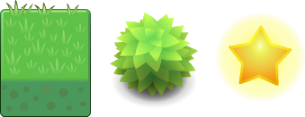

+++
title = "Hello Dart: Introduction to Programming"
date = 2015-05-01
updated = 2020-05-05
description = "Hello Dart is a playful introduction to programming. Learn the basics of programming with the awesome Dart language."
image = "hello-dart.png"
comments = true
sidebarName = "Introduction"
pagingName = "Intro"

# Series Overview Info
overview = true
overviewImage = "hello-dart-overview.png"
overviewDescription = """
Hello Dart is a visual and playful introduction to programming. We use the modern and fun Dart programming language. 
"""
topics = [ "Dart" ]
parts = 5
weight = 3
+++

> `Hello Dart` is a playful introduction to programming with Dart.

Previously, it was hardly realistic to program mobile or web-based applications. The Dart programming language provides a solution how such applications can be programmed much easier.

`Hello Dart` guides you through the basics of programming. No prior programming knowledge is required. The playful world of `Hello Dart` visualizes the execution of your programs. Soon you will want to break out of the limiting rules of the `Hello Dart` world, which is intended. After the introduction with `Hello Dart` you will have a good foundation to start realizing your own web projects.

<!--

  Read <a class="alert-link" href="/library/hello-dart/background/">Background Infos</a> to learn why I see Dart as the ideal language for beginners and professionals to program web and mobile apps.

-->

## The World

The world of `Hello Dart` consists of fields, trees and stars.

## The Player

In the world of `Hello Dart` we move around with our character. You can choose from one of four characters.

A game character, called `Player` has the following actions and sensors that he/she can use:

### Actions

<table class="table">
  <thead>
    <tr>
      <th>Action</th>
      <th>Command</th>
      <th>Description</th>
    </tr>
  </thead>
  <tbody>
    <tr>
      <td style="vertical-align:middle"></td>
      <td style="vertical-align:middle"><code>move()</code></td>
      <td style="vertical-align:middle">The player makes a step forward.</td>
    </tr>
    <tr>
      <td style="vertical-align:middle"></td>
      <td style="vertical-align:middle"><code>turnLeft()</code></td>
      <td style="vertical-align:middle">The player turns left by 90 degrees.</td>
    </tr>
    <tr>
      <td style="vertical-align:middle"></td>
      <td style="vertical-align:middle"><code>turnRight()</code></td>
      <td style="vertical-align:middle">The player turns right by 90 degrees.</td>
    </tr>
    <tr>
      <td style="vertical-align:middle"></td>
      <td style="vertical-align:middle"><code>putStar()</code></td>
      <td style="vertical-align:middle">The player puts down a star.</td>
    </tr>
    <tr>
      <td style="vertical-align:middle"></td>
      <td style="vertical-align:middle"><code>removeStar()</code></td>
      <td style="vertical-align:middle">The player removes a star.</td>
    </tr>
    <tr>
      <td style="vertical-align:middle"></td>
      <td style="vertical-align:middle"><code>say('Hello')</code></td>
      <td style="vertical-align:middle">The player says something using a speech bubble.</td>
    </tr>
  </tbody>
</table>

### Sensors

<table class="table">
  <thead>
    <tr>
      <th>Sensor</th>
      <th>Command</th>
      <th>Description</th>
    </tr>
  </thead>
  <tbody>
    <tr>
      <td style="vertical-align:middle"></td>
      <td style="vertical-align:middle"><code>canMove()</code></td>
      <td style="vertical-align:middle">The player checks if he can move to the next field.</td>
    </tr>
    <tr>
      <td style="vertical-align:middle"></td>
      <td style="vertical-align:middle"><code>treeFront()</code></td>
      <td style="vertical-align:middle">The player checks if there is a tree in front.</td>
    </tr>
    <tr>
      <td style="vertical-align:middle"></td>
      <td style="vertical-align:middle"><code>treeLeft()</code></td>
      <td style="vertical-align:middle">The player checks if there is a tree on the left side.</td>
    </tr>
    <tr>
      <td style="vertical-align:middle"></td>
      <td style="vertical-align:middle"><code>treeRight()</code></td>
      <td style="vertical-align:middle">The player checks if there is a tree on the right side.</td>
    </tr>
    <tr>
      <td style="vertical-align:middle"></td>
      <td style="vertical-align:middle"><code>onStar()</code></td>
      <td style="vertical-align:middle">The player checks if he is on a star.</td>
    </tr>
  </tbody>
</table>

## Let's go

#### Installation

First you need to install the Dart Editor and the `Hello Dart` scenarios. It's described in those [installation instructions](/library/hello-dart/install/).

#### Background Infos

If you want to know more about why I recommend Dart for programming, see [background information](/library/hello-dart/background/).

***

### Copyright

I publish the `Hello Dart` materials under the [Creative Commons Attribution 4.0](https://creativecommons.org/licenses/by/4.0/) license. That means you can do pretty much everything you want with it. But you need to comply with the following:

* If you use my materials or programs, you must clearly indicate that I'm the original author of this material. Include my name, a link to the original and a link to the license. It could look something like the way I provide attribution to the images at the bottom of every page.

***

*Credits* 
<em class="small">
  [Planet Cute](http://www.lostgarden.com/2007/05/dancs-miraculously-flexible-game.html) images by Daniel Cook (Lostgarden.com), published under [CC BY 3.0](http://creativecommons.org/licenses/by/3.0/us/). 
[Oleg Yadrov](https://www.linkedin.com/in/olegyadrov) improved the "Planet Cute" images and was so kind to let me use them. The images were optimized with the great [TexturePacker](https://www.codeandweb.com/texturepacker).
</em>