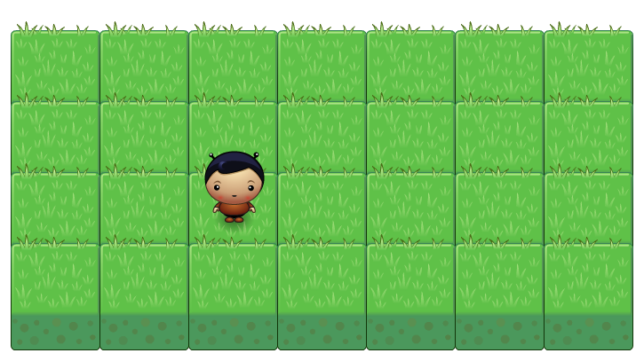

+++
title = "Installation"
date = 2015-01-26
description = "Dart Editor installieren. Die Hello Dart Szenarien laden und ein erstes Dart Programm starten."
image = "hello-dart.png"
prettify = true
comments = true
commentsIdentifier = "/library/hello-dart/de/install/"
aliases = [ 
  "/library/hello-dart/de/install/" 
]

sidebarName = "<i class=\"fa fa-fw fa-cog\"></i> Installation"
pagingName = "<i class=\"fa fa-fw fa-cog\"></i>"
weight = 2

[[sidebars]]
header = "Links"
[[sidebars.items]]
text = "<i class=\"fa fa-fw fa-download\"></i> Dart Editor Download"
link = "https://www.dartlang.org/tools/download.html"
[[sidebars.items]]
text = "<i class=\"fa fa-fw fa-download\"></i> Hello Dart Szenarien"
link = "https://github.com/marcojakob/hello-dart/releases"
[[sidebars.items]]
text = "<i class=\"fa fa-fw fa-file-word-o\"></i> Seite als Word-Datei"
link = "/de/library/convert-web-page-to-word/"
+++

Zum Programmieren brauchen wir... 

* den **Dart Editor** und 
* die `Hello Dart`-Szenarien.

## Dart Editor installieren

1. Laden Sie den [Dart Editor hier](https://www.dartlang.org/tools/download.html) herunter.
2. Entpacken Sie das Zip mit dem Dart Editor auf Ihre Festplatte.

  <strong>Hinweis:</strong> Dart Editor benötigt Java in der Version 6 oder höher. Falls nötig, laden Sie die [Java Runtime](http://www.oracle.com/technetwork/java/javase/downloads/) herunter. Bei anderen Problemen mit der Installation, suchen Sie unter <a href="https://www.dartlang.org/tools/editor/troubleshoot.html" class="alert-link">Troubleshoot</a> nach einer Lösung.

### Was enthält die Installation?

***

  

    
  

  

    Dart Editor ist ein einfacher aber trotzdem mächtiger Editor. Damit können Dart-Projekte erstellt, editert und verwaltet werden. 
  

***

  

    
  

  

    Dies ist eine spezielle Version des Chrome Web Browsers, genannt Dartium, welcher die Dart VM (virtual machine) enthält. Dart Programme können direkt in diesem Browser laufen. Der Dart Editor führt Projekte automatisch darin aus.
  

***

  

    
  

  

    Das Verzeichnis <strong>dart-sdk</strong> enthält das Dart Software Development Kit. Hier befinden sich die Dart Standard-Bibliotheken und Tools für die Kommandozeile.
  

***

## Dart Editor starten

 Starten Sie den Dart Editor mit einem Doppelklick auf die ausführbare Datei im Installationsordner.

## `Hello Dart` Szenarien öffnen

1. Laden Sie unter [Hello Dart-Releases](https://github.com/marcojakob/hello-dart/releases) die Zip-Datei `hello_dart_scenarios.zip` herunter (nehmen Sie die neuste Version).  
2. Entpacken Sie die Zip-Datei.
3. Im Dart Editor: Klicken Sie auf *File* | *Open Existing Folder...*. Wählen Sie dort den Ordner `hello_dart_scenarios` aus, den Sie vorher entpackt haben.
4. Öffnen Sie im Unterordner `web/part1/scenario1.01` die Datei `my_player.dart` mit einem Doppelklick.   

5. Klicken Sie auf das *Run*-Symbol .

Jetzt sollte sich automatisch der Chromium Browser öffnen mit dem ersten Szenario:

***

### Wie weiter?

Im [Teil 1](/de/library/hello-dart/part1/) machen wir unsere ersten Schritte beim Programmieren.

***

*Quellen* 
<em class="small">
[Planet Cute](http://www.lostgarden.com/2007/05/dancs-miraculously-flexible-game.html) Bilder stammen von Daniel Cook (Lostgarden.com), veröffentlicht unter [CC BY 3.0](http://creativecommons.org/licenses/by/3.0/us/). 
[Oleg Yadrov](https://www.linkedin.com/in/olegyadrov) hat die "Planet Cute" Bilder weiterentwickelt und mir zur Verfügung gestellt. Optimiert wurden sie mit dem grossartigen [TexturePacker](https://www.codeandweb.com/texturepacker).
</em>