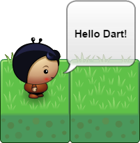
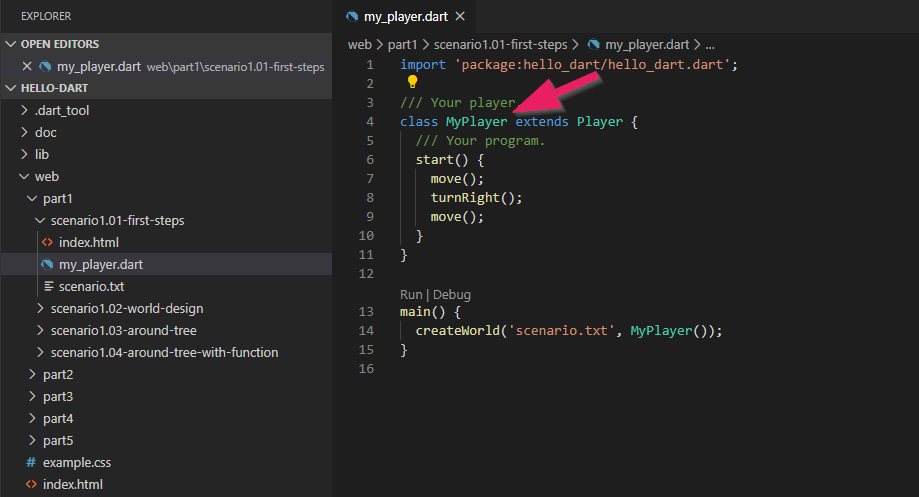
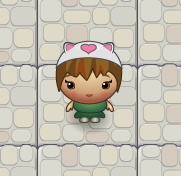

+++
title = "Part 1: First Steps"
date = 2015-05-01
updated = 2020-05-05
description = "The first steps in programming with Dart. Get to know classes and functions and understand what the main function is for."
image = "around-tree.png"
prettify = true
comments = true

pagingName = "1"
weight = 3

[[sidebars]]
header = "Solutions"
[[sidebars.items]]
text = "<i class=\"fa fa-fw fa-check-square-o\"></i> Solutions Part 1"
link = "/library/hello-dart/part1/solutions/"

[[sidebars]]
header = "Links"
[[sidebars.items]]
text = "<i class=\"fa fa-fw fa-file-word-o\"></i> Page as Word File"
link = "/library/convert-web-page-to-word/"
+++

In this part we will take our first steps in programming.

### Prerequisites

* You need no prior knowledge of programming to start with `Hello Dart`!
* You must have Dart and the `Hello Dart` scenarios installed. If you don't have it yet, please go through the [installation instructions](/library/hello-dart/install/).

***

## The `MyPlayer` Class

Open the file `my_player.dart` from the folder `scenario1.01`.

Let's have a look at the `MyPlayer` **class**. Attributes and behavior of our player are defined between the curly braces `{` and `}`.

Currently, the only thing that is in this class is `start()` and three instructions to move the player. `start()` is a function (functions are sometimes also called *methods*). In this function we can change the behavior of the player.

#### <i class="fa fa-rocket mg-t"></i> TASK 1.01: First Steps

Change the `start()` function so that the player first makes a step, then places a star, and finally takes another step.

In the [introduction](/library/hello-dart/) you will find all commands a player can execute.

  <strong>Note:</strong> After every command you must place a semicolon <code>;</code>.

Click the *run* button  to test your program.

## `index.html` and the `main()` Function

As we let our programs run in a web browser, we always need an `html` file. In `index.html` you will find an declaration for the browser to load the `my_player.dart` script. For the browser to know where this Dart program starts, a `main()` function is needed.

At the bottom of the Dart file you will find the `main()` function. Each Dart program must have exactly one `main()` function as entry point.

In our `main()`, we call the `createWorld(...)` function. This function is part of `Hello Dart` and builds the whole world with the player and the fields. As soon as everything is ready, our `start()` function is automatically called and the player starts to move.

## Design the World

The scenarios of `Hello Dart` include additional graphics that you can turn on if you want.

#### <i class="fa fa-rocket mg-t"></i> TASK 1.02: World Design

Change the `main()` function as follows:

<pre class="prettyprint lang-dart">
main() {
  character = 'catgirl';
  field = 'stone';
  
  createWorld('scenario.txt', MyPlayer());
}
</pre>

For **character** you can define values in quotes. Valid values are `boy`, `catgirl`, `stargirl`, or `pinkgirl`.

For **field** you can use the values `grass`, `stone`, `wood`, or `dirt`.

  <strong>Hint:</strong> To test a change it's fastest if you click <code>Ctrl+S</code> (or <code>⌘+S</code>) to save the file in the Dar Editor and then click <code>F5</code> (or <code>⌘+R</code>) to refresh the browser.

#### <i class="fa fa-rocket mg-t"></i> TASK 1.03: Around Tree

Open `scenario1.03`. If you start the scenario you should see a world with three trees and one star.

Write a program that makes your player move on the specified path to the star. He must move around the trees. Arriving on the star, he should remove it.

## New Functions

#### <i class="fa fa-rocket mg-t"></i> TASK 1.04: Around Tree with Function

If you've solved task 1.03 correctly, your program will probably have *three equal parts*, namely for walking aroud every tree. We can improve this by introducing a new function so we don't need to repeat the same sequence. Add the following function below the closing brace `}` from the `start()` function:

<pre class="prettyprint lang-dart">
goAroundTree() {

}
</pre>

Write between the curly braces the sequence of commands that are needed to go around one tree.

Now, use the new `goAroundTree()` function in your `start()` function for each of the three trees.

## What's next?

&rarr; Continue with [Part 2: Loops](/library/hello-dart/part2/)

***

*Credits* 
<em class="small">
  [Planet Cute](http://www.lostgarden.com/2007/05/dancs-miraculously-flexible-game.html) images by Daniel Cook (Lostgarden.com), published under [CC BY 3.0](http://creativecommons.org/licenses/by/3.0/us/). 
[Oleg Yadrov](https://www.linkedin.com/in/olegyadrov) improved the "Planet Cute" images and was so kind to let me use them. The images were optimized with the great [TexturePacker](https://www.codeandweb.com/texturepacker). 
Some exercises in `Hello Dart`were inspired by [Kara](http://www.swisseduc.ch/compscience/karatojava/javakara/). Kara was developed by Jürg Nievergelt, Werner Hartmann, Raimond Reichert et. al.
</em>
