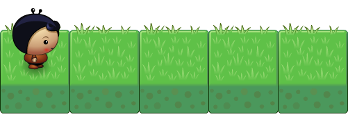
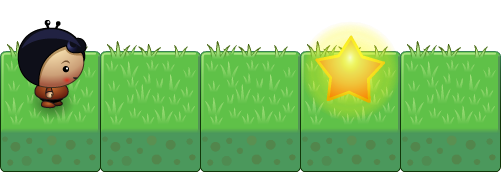
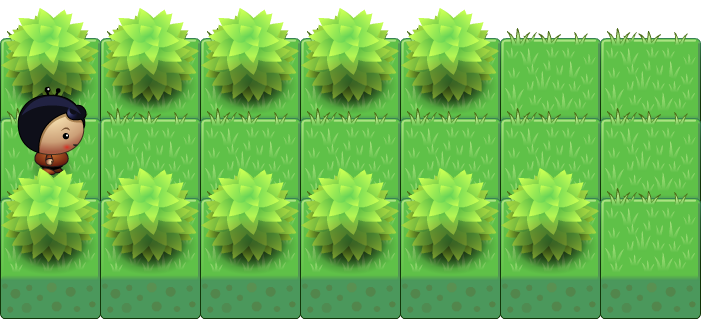
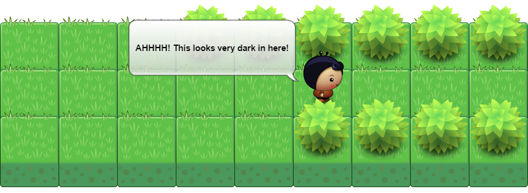
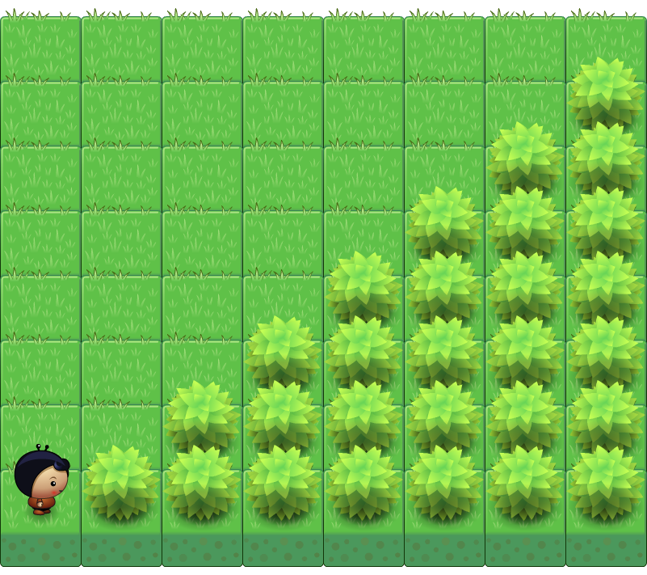

+++
title = "Teil 2: Schleifen"
date = 2015-01-21
updated = 2020-05-05
description = "Lernen Sie Schleifen programmieren mit Dart. Mit logischen Operatoren steuern wir den Programmablauf."
image = "leaving-the-tunnel.png"
prettify = true
comments = true
commentsIdentifier = "/library/hello-dart/de/part2/"
aliases = [ 
  "/library/hello-dart/de/part2/" 
]

pagingName = "2"
weight = 4

[[sidebars]]
header = "Lösungen"
[[sidebars.items]]
text = "<i class=\"fa fa-fw fa-check-square-o\"></i> Lösungen Teil 2"
link = "/de/library/hello-dart/part2/solutions/"

[[sidebars]]
header = "Links"
[[sidebars.items]]
text = "<i class=\"fa fa-fw fa-file-word-o\"></i> Seite als Word-Datei"
link = "/de/library/convert-web-page-to-word/"
+++

Im letzten Teil haben wir gelernt, wie wir unserem Spieler eine Reihe von Anweisungen geben können. Anstatt jede Anweisung einzeln aufzuführen, können wir auch Anweisungen wiederholen lassen. Beim Programmieren nennt man solche Wiederholungen **Schleifen**.

Als erstes Beispiel für eine Schleife möchten wir Folgendes tun: 

#### <i class="fa fa-rocket mg-t"></i> AUFGABE 2.01: Loop

Der Spieler soll sich solange vorwärts bewegen, bis er nicht mehr weiter kann.

In Dart können wir das wie folgt ausdrücken:

<pre class="prettyprint lang-dart">
while (canMove()) {
  move();
}
</pre>

Mit `while` wird etwas solange wiederholt, wie die Bedingung in der Klammer zutrifft. Wenn eine Bedingung zutrifft, dann ist sie `true` (=wahr). Sobald der Spieler am Rand ankommt, dann meldet die Sensor-Funktion `canMove()` den Wert `false` (=falsch) zurück und der Spieler hört auf, sich zu bewegen.

Testen Sie dieses Programm, indem Sie die `while`-Schleife in die `start()`-Funktion von `scenario2.01` hinein schreiben.

## Logische Operatoren

Unsere Sensor-Funktionen (siehe [Einleitung](/library/hello-dart/de/#sensoren)) antworten alle entweder mit `true` oder `false`, wenn man diese aufruft. Einen solchen Wert, der entweder wahr oder falsch sein kann, nennt man [Boolean](http://de.wikipedia.org/wiki/Boolesche_Variable).  

Boolesche Werte können mit Hilfe von logischen Operatoren auch kombiniert oder verändert werden. Die folgende Tabelle zeigt die drei wichtigsten logischen Operatoren in Dart:

<table class="table">
  <thead>
    <tr>
      <th>Operator</th>
      <th>Beschreibung</th>
      <th>Beispiel</th>
      <th></th>
    </tr>
  </thead>
  <tbody>
    <tr>
      <td><code>&&</code></td>
      <td>und</td>
      <td><code>treeFront() && onStar()</code></td>
      <td>Ist erfüllt (true), wenn beide Aussagen erfüllt sind, das heisst wenn der Spieler vor einem Baum <strong>und</strong> auf einem Stern steht.</td>
    </tr>
    <tr>
      <td><code>||</code></td>
      <td>oder</td>
      <td><code>treeFront() || onStar()</code></td>
      <td>Ist dann erfüllt (true), wenn entweder die eine <strong>oder</strong> die andere Aussage oder beide erfüllt sind.</td>
    </tr>
    <tr>
      <td><code>!</code></td>
      <td>nicht</td>
      <td><code>!treeFront()</code></td>
      <td>Ändert einen Ausdruck von true in false und umgekehrt. Diese Aussage wäre also dann erfüllt (true), wenn der Spieler <strong>nicht</strong> vor einem Baum steht.</td>
    </tr>
  </tbody>
</table>

Ein Beispiel in Dart könnte wie folgt aussehen:

<pre class="prettyprint lang-dart">
if (treeLeft() && onStar()) {
  // Mache etwas ...
}
</pre>

oder auch kombiniert:

<pre class="prettyprint lang-dart">
if (treeLeft() && !treeRight()) {
  // Mache etwas ...
}
</pre>

#### <i class="fa fa-rocket mg-t"></i> AUFGABE 2.02: Loop Star

Öffnen Sie das `scenario2.02` und programmieren Sie den Spieler mit einer Schleife so, dass er vorwärts läuft, bis er auf dem Stern steht. 

#### <i class="fa fa-rocket mg-t"></i> AUFGABE 2.03: Leaving the Tunnel

Unser Spieler ist in einem Tunnel und möchte raus. Schreiben Sie ein Programm für `scenario2.03`, bei dem der Spieler aus dem Tunnel hinaus läuft und stehen bleibt, sobald auf einer der beiden Seiten kein Baum mehr steht.

Am Schluss soll er ausserdem einen Stern ablegen.

#### <i class="fa fa-rocket mg-t"></i> AUFGABE 2.04: Afraid of Tunnel

Der Spieler hat Angst vor Tunneln. Er soll auf jedem Feld überprüfen, ob es ein Tunneleingang ist (das heisst, ob es auf beiden Seiten Bäumen hat). Ist dies der Fall, so soll er stehen bleiben und in einer Sprechblase sagen, dass er Angst hat.

#### <i class="fa fa-rocket mg-t"></i> AUFGABE 2.05: Climbing Up

Der Spieler soll eine beliebig lange Treppe hochlaufen.

Schreiben Sie eine Funktion `oneStepUp()`, wo Sie den Spieler eine einzelne Stufe hochsteigen lassen. Überlegen Sie sich, wie Sie erkennen können, ob der Spieler noch eine Stufe steigen muss oder ob er zuoberst angekommen ist.

## For-Schleifen

Es gibt neben der `while`-Schleife eine weitere, sehr wichtige Art von Schleife: die `for`-Schleife.

<pre class="prettyprint lang-dart">
for (var i = 0; i &lt; 4; i++) {
  move();
}
</pre>

Bei diesem Beispiel wird ein Zähler `i` verwendet. Der Zähler wird zuerst auf `0` gesetzt. Danach wird bei jedem Schleifendurchgang geprüft, ob `i` kleiner ist als `4` und schliesslich wird `i` um eins erhöht. Das bedeutet, dass die `move()`-Anweisung in dieser Schleife vier mal ausgeführt wird.

Sie werden der `for`-Schleife später immer wieder begegnen, auch zum Teil in etwas abgewandelter Form. Für den Moment reicht uns mal das Wissen, dass es sie gibt.

## Wie weiter?

&rarr; Im [Teil 3](/de/library/hello-dart/part3/) lernen wir mit *bedingten Anweisungen* eine weitere Art kennen, unsere Programme zu steuern.

***

*Quellen* 
<em class="small">
[Planet Cute](http://www.lostgarden.com/2007/05/dancs-miraculously-flexible-game.html) Bilder stammen von Daniel Cook (Lostgarden.com), veröffentlicht unter [CC BY 3.0](http://creativecommons.org/licenses/by/3.0/us/). 
[Oleg Yadrov](https://www.linkedin.com/in/olegyadrov) hat die "Planet Cute" Bilder weiterentwickelt und mir zur Verfügung gestellt. Optimiert wurden sie mit dem grossartigen [TexturePacker](https://www.codeandweb.com/texturepacker). 
Einige Übungen in `Hello Dart` sind inspiriert von [Kara](http://www.swisseduc.ch/informatik/karatojava/). Kara wurde entwickelt von Jürg Nievergelt, Werner Hartmann, Raimond Reichert und anderen.
</em>