+++
title = "Kısım 1: Scene Builder"
date = 2018-06-01
description = "JavaFX projesinin nasıl oluşturulacağını öğrenin. Bu yedi kısımdan oluşan ve JavaFX ile bir adres uygulamasının tasarımı, programlaması ve yayımlanmasını içeren tutorialın bir parçasıdır."
image = "addressapp-part1.png"
prettify = true
comments = true 
commentsIdentifier = "/library/javafx-8-tutorial/tr/part1/"
aliases = [ 
  "/library/javafx-8-tutorial/tr/part1/"
]
weight = 1

[[sidebars]]
header = "Download Sources"
[[sidebars.items]]
text = "<i class=\"fa fa-fw fa-download\"></i> Eclipse Projesi olarak Kısım 1 <em>(en düşük JDK 8u40 gerektirir)</em>"
link = "https://github.com/marcojakob/tutorial-javafx-8/releases/download/v1.1/addressapp-jfx8u40-part-1.zip"
+++

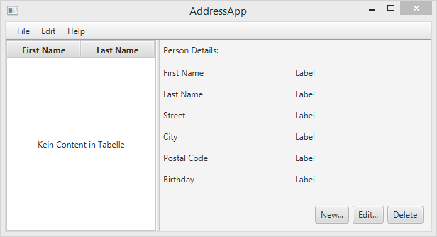

### Kısım 1 deki başlıklar

* JavaFX i tanıma
* JavaFX projesi oluşturma ve başlatma
* Kullanıcı arayüzü tasarımı için Scene Builder kullanımı
* Model-Görünüm--Kontrol (MVC) düzeni kullanarak temel uygulama yapısı

*****

### Gereksinimler

* En son [Java JDK 8](http://www.oracle.com/technetwork/java/javase/downloads/index.html) ( **JavaFX 8** içerir).
* Eclipse 4.4 ya da daha yeni sürüm e(fx)clipse plugin ile beraber. En kolay yolu yapılandırılmış dağıtımı[e(fx)clipse web sayfasından](http://efxclipse.bestsolution.at/install.html#all-in-one) indirmektir. Alternatif olarak Eclipse kurulumunuzdaki [güncelleme sitesini](http://www.eclipse.org/efxclipse/install.html) kullanabilirsiniz.
* [Scene Builder 8.0](http://gluonhq.com/products/scene-builder/) (provided by Gluon because [Oracle only ships it in source code form](http://www.oracle.com/technetwork/java/javase/downloads/sb2download-2177776.html)).

### Eclipse Konfigürasyonu 

Eclipse'e JDK 8 kullanmasını ve Scene Builder'ı nereden bulacağını söylememiz lazım: 

1. Eclipse Preferences'ı açın ve *Java | Installed JREs* e gidin.

2. *Add...*'e tıklayın, *Standard VM* seçin ve JDK 8 in kurulum *Klasör*ünü seçin. 

3. Diğer JRE ve JDK ları kaldırın böylece **JDK 8 varsayılan haline gelir**.    
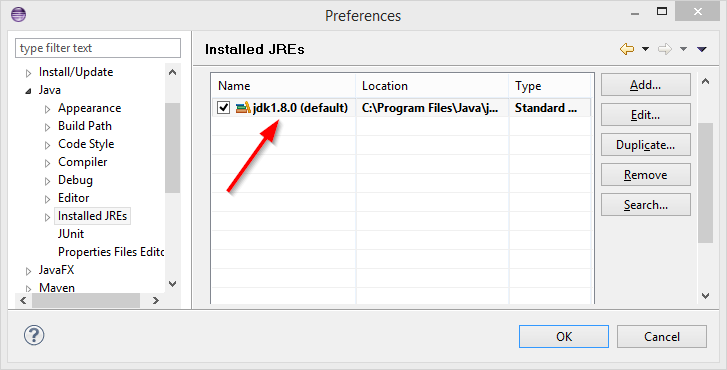

4. *Java | Compiler* a gidin. **Compiler compliance level ı 1.8** yapın.   
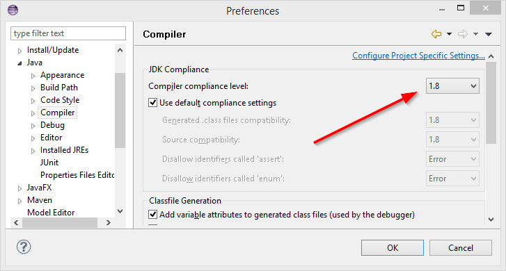

5. *JavaFX* preferences a gidin. Scene Builder exe dosasının yolunu gösterin.   
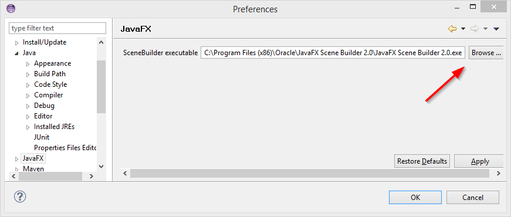

### Faydalı Bağlantılar

Aşağıdaki bağlantıları yer işareti olarak kaydedebilirsiniz:

* [Java 8 API](http://docs.oracle.com/javase/8/docs/api/) - Standart Java sınıfları için JavaDoc 
* [JavaFX 8 API](http://docs.oracle.com/javase/8/javafx/api/) - JavaFX sınıfları için JavaDoc
* [ControlsFX API](https://controlsfx.bitbucket.io/) - İlave JavaFX kontrolleri için [ControlsFX projesi](http://fxexperience.com/controlsfx/) JavaDoc
* [Oracle JavaFX Tutorial](http://docs.oracle.com/javase/8/javafx/get-started-tutorial/get_start_apps.htm) - Oracle ın resmi JavaFX Tutorialı.

Şimdi başalayalım!

*****

## Yeni bir JavaFX projesi oluştur

Eclipse te (e(fx)clipse kurulu) *File | New | Other...* a gidin ve *JavaFX Project* seçin.   
Proje ismini verin (ör. *AddressApp*) ve *Finish* e tıklayın.

Eğer otomatik olarak oluşturulmuşsa *application* paketini ve içeriğini silin.

### Paketleri Oluştur

Başlangıçtan itibaren iyi yazılım tasarım ilkelerini takip edeceğiz. Çok önemli iyi ilkelerden birisi [**Model-Görüntü-Kontrol** (MVC)] ilkesidir (http://en.wikipedia.org/wiki/Model_View_Controller). Buna göre kodumuzu üç parçaya bölüyoruz ve her biri için bir paket oluşturuyoruz (src klasöre sağ tıkla, *New... | Package*):

* `ch.makery.address` - kontrol sınıflarının *birçoğunu* içerir (= iş mantığı)
* `ch.makery.address.model` - model sınıflarını içerir
* `ch.makery.address.view` - görünümleri içerir

**Not:** Görünüm paketimizde doğrudan tek bir görünümle ilgili olan bazı kontroller de olacak. Bunlara **görünüm-kontrolleri** diyelim.

*****

## FXML Yerleşim Dosyası Oluşturma

Kullanıcı arayüzü oluşturmanın iki yolu var. Ya XML dosyası ile yapılır ya da herşey Java da kodlanır. Internete baktığınızda her ikisini de görürsünüz. Biz birçok kısım için XML (.fxml ile biten) kullanacağız. Bunun kontrol ve görünümü ayrı tutmanın daha temiz bir yolu olarak görüyorum. Dahası XML dosyamızı düzenlemek için Scene Builder'ı kullanabiliriz. Bu sayede doğrudan XML ile uğraşmayacağız.

Görünüm paketine sağ tıklayın ve `PersonOverview` isminde yeni bir *FXML Document* oluşturun.   

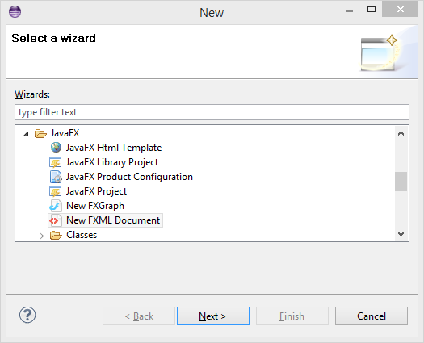

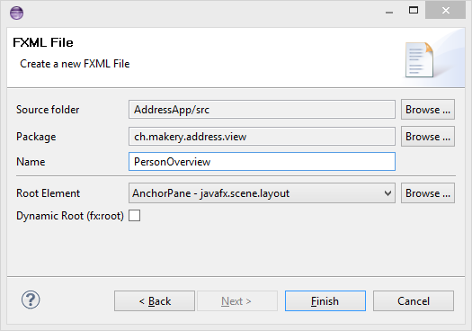

*****

## Scene Builder ile tasarım

  <strong>Note:</strong> Eğer çalıştırmayı başaramazsanız tutorial'ın bu kısmının kaynağını indirin ve içindeki fxml ile deneyin.

`PersonOverview.fxml`'e sağ tıklayın ve *Open with Scene Builder*'ı seçin. Şimdi Scene Builder'ı sadece *AncherPane* (soldaki Hierarchy altında) ile göreceksiniz.

(Eğer Scene Builder açılmazsa, *Window | Preferences | JavaFX*'e gidin ve Scene Builder kurulumu için doğru yolu gösterin).

1.Hierarchy'den *Anchor Pane*'i seçin ve Layout altında (sağ tarafta) boyutu ayarlayın:   

2. Kütüphaneden ana alana sürükleyerek *Split Pane (Horizontal Flow)* ekleyin. *Hierarchy*'deki *Split Pane*'e sağ tıklayın ve *Fit to Parent* seçin.   

3. *Split Pane*'in sol tarafına *TableView* (*Controls*'un altında) sürükleyin. TableView'ı seçin (sütun değil) ve aşağıdaki düzen kısıtlamalarını TableView'e uygulayın. Bir *AnchorPane* içerisinde her zaman için çapaları dört kenara balayabilirsiniz ([Düzen hakkında daha fazla bilgi için](http://docs.oracle.com/javase/8/javafx/layout-tutorial/builtin_layouts.htm)).   

4. *Preview | Show Preview in Window* menüsüne giderek doğru davranıp davranmadığına bakın. Pencerenin boyutunu değiştirmeyi deneyin. Kenarlara çapalandığı için TableView'ın da pencereyle beraber boyut değiştirmesi gerekir.

5. Sütun metinlerini (Properties altında) "First Name" ve "Last Name" olarak değiştirin.   

6. *TableView*'ı seçin ve *Column Resize Policy* (Properties altında) olarak *constrained-resize* seçin. Böylece sütunların mevcut alanın tamamını kaplaması sağlanır.   

7. Sağ tarafa "Person Details" metiniyle bir *Label* ekleyin (ipucu: *Label*'ı bulmak için aramayı kullanın). Yerleşimini çapaları kullanarak ayarlayın.   

8. Sağ tarafa *GridPane* ekleyin, seçin ve yerleşimini çapalarla düzenleyin (top, right and left).    
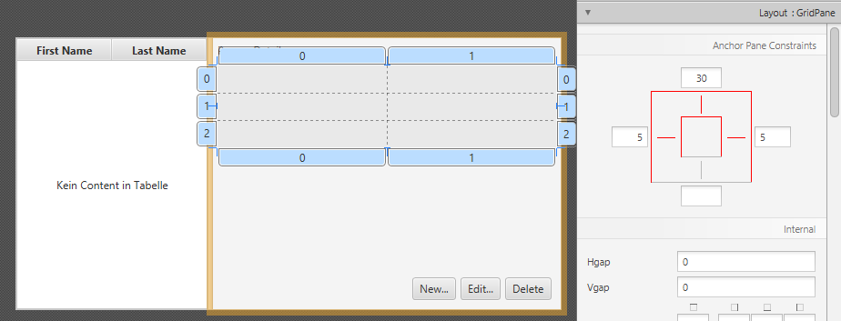

9. Hücrelere aşaıdaki etiketleri (label) ekleyin.   
*Not: GridPane'e satır eklemek için varolan satırlardan birisini seçin (sarıya döner) satır numarasına sağ tıklayın ve "Add Row"u seçin.*   
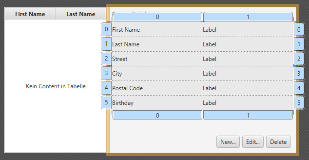

10. Alta bir *ButtonBar* ekleyin. Bar'a üç buton ekleyin. Şimdi çapaları (sağ ve alt) *ButtonBar*'a bağlayın ki doğru yerde dursunlar.   

11. Şimdi aşağıdaki gibi birşey görmeniz gerekiyor. *Preview* menüsünü kullanarak yeniden boyutlanma davranışını test edin.   
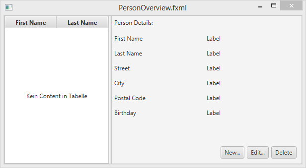

*****

## Ana Uygulamayı Oluşturma

Kök yerleşim için başka bir FXML'e ihtiyacımız var. Bu dosya bir menu bar içerecek ve oluşturduğumuz `PersonOverview.fxml`'i içine alacak.

1. View paketi içerisinde `RootLayout.fxml` isminde yeni bir *FXML Document* oluşturun. Bu defa kök elemanı olarak *BorderPane* seçin.   
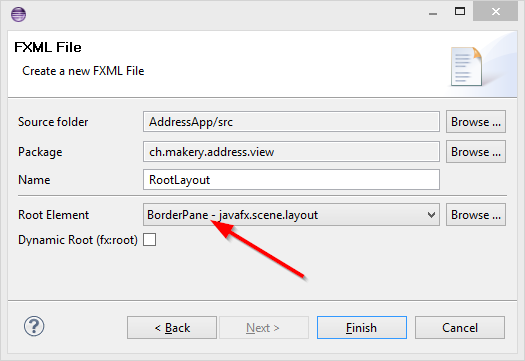

2. Scene Builder'da `RootLayout.fxml`'i açın.

3. *BorderPane*'i *Pref Width* 600 ve *Pref Height* 400 olarak boyutlandırın.   
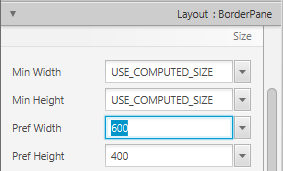

4. TOP kısma *MenuBar* ekleyin. Menü fonksiyonlarını şimdilik gerçeklemeyeceğiz.   

### JavaFX Ana Sınıfı 

Şimdi uygulamamızı `RootLayout.fxml` ile başlatan ve merkeze `PersonOverview.fxml` ekleyen **main java class** oluşturmamız gerekiyor. 

1. Projeye sa tıklayın ve *New | Other...*'ı seçin ve *JavaFX Main Class*'ı seçin.   
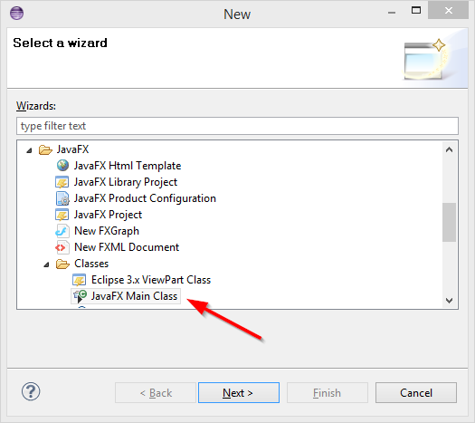

2. Sınıfı `MainApp` olarak adlandıracağız ve `ch.makery.address` kontrol paketine koyacağız (not: Bu `view` ve `model` altpaketlerinin ana paketidir).   
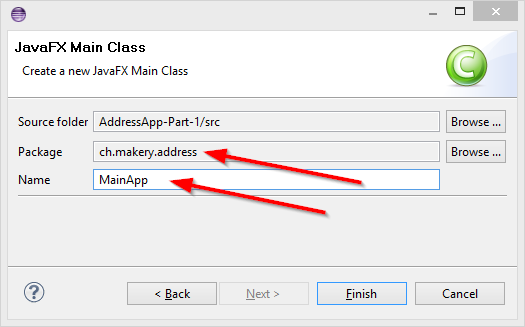

Oluşturulan `MainApp.java` sınıfı `Application` sınıfından türetilir ve iki metod içerir. Bu yapı JavaFX Uygulamasını başlatmak için gereken temel yapıdır. Bizim için en önemli kısmı `start(Stage primaryStage)` metodudur. Uygulama `main` metod içerisinden balatıldığında (`launched`) bu metod otomatik olarak çağırılır. 

Gördüğünüz gibi `start(...)` metodu parametre olarak bir `Stage` alır. Aşağıdaki grafik tüm avaFX uygulamalarının yapısını göstermektedir:

   
*Image Source: http://www.oracle.com*

**Aynı tiyatro gibi**: `Stage` (sahne) ana kapsayıcıdır ve genelde sınırları olan, küçültme, büyütme ve kapatma butonları olan bir `Pencere`'dir. `Stage` içerisine bir `Scene` (manzara) eklersiniz ve bu başka bir `Scene` ile değiştirilebilir. `Scene` içerisine `AnchorPane`, `TextBox` vb. gerçek JavaFX düğümleri eklenir.

Bu konuda daha fazla bilgi için şuraya bakın [Working with the JavaFX Scene Graph](http://docs.oracle.com/javase/8/javafx/scene-graph-tutorial/scenegraph.htm).

*****

`MainApp.java`'yı açın ve kodu aşağıdaki ile değiştirin:

<pre class="prettyprint lang-java">
package ch.makery.address;

import java.io.IOException;

import javafx.application.Application;
import javafx.fxml.FXMLLoader;
import javafx.scene.Scene;
import javafx.scene.layout.AnchorPane;
import javafx.scene.layout.BorderPane;
import javafx.stage.Stage;

public class MainApp extends Application {

    private Stage primaryStage;
    private BorderPane rootLayout;

    @Override
    public void start(Stage primaryStage) {
        this.primaryStage = primaryStage;
        this.primaryStage.setTitle("AddressApp");

        initRootLayout();

        showPersonOverview();
    }
    
    /**
     * Kök Yerleşimi Başlatır.
     */
    public void initRootLayout() {
        try {
            // Load root layout from fxml file.
            FXMLLoader loader = new FXMLLoader();
            loader.setLocation(MainApp.class.getResource("view/RootLayout.fxml"));
            rootLayout = (BorderPane) loader.load();
            
            // Show the scene containing the root layout.
            Scene scene = new Scene(rootLayout);
            primaryStage.setScene(scene);
            primaryStage.show();
        } catch (IOException e) {
            e.printStackTrace();
        }
    }

    /**
     * Kök yerleşim içerisinde kişi önizlemeyi gösterir.
     */
    public void showPersonOverview() {
        try {
            // Load person overview.
            FXMLLoader loader = new FXMLLoader();
            loader.setLocation(MainApp.class.getResource("view/PersonOverview.fxml"));
            AnchorPane personOverview = (AnchorPane) loader.load();
            
            // Set person overview into the center of root layout.
            rootLayout.setCenter(personOverview);
        } catch (IOException e) {
            e.printStackTrace();
        }
    }
    
	/**
	 * Main stage i gönderir.
	 * @return
	 */
	public Stage getPrimaryStage() {
		return primaryStage;
	}

    public static void main(String[] args) {
        launch(args);
    }
}
</pre>

Kod içerisindeki yorumlar ne olduğu hakkında fikir verecektir.

Uygulamayı çalıştırdığınızda bu kısmın başındaki ekran görünümüne benzer birey görmeniz gerekir.

### Sık Karşılaşılan Sorunlar

Eğer JavaFX belirttiğiniz `fxml` dosyasını bulamazsa aşağıdaki hata mesajını alabilirsiniz: 

`java.lang.IllegalStateException: Location is not set.`

Bu problemi çözmek için `fxml` dosyasının isminin yazımında hata yapmadığınızı tekrar kontrol edin!

  Hala çalışştıramazsanız, tutorial'ın bu kısmının kaynağını indirip içindeki fxml ile deneyin.

*****

### Sırada Ne Var?

[Tutorial Kısım 2](/tr/library/javafx-tutorial/part2/) de AddressApp uygulamamıza biraz veri ve işlevsellik ekleyeceğiz.

##### İlginizi çekebilecek diğer makaleler

* [JavaFX Dialogs (official)](/blog/javafx-dialogs-official/)
* [JavaFX Date Picker](/blog/javafx-8-date-picker/)
* [JavaFX Event Handling Examples](/blog/javafx-8-event-handling-examples/)
* [JavaFX TableView Sorting and Filtering](/blog/javafx-8-tableview-sorting-filtering/)
* [JavaFX TableView Cell Renderer](/blog/javafx-8-tableview-cell-renderer/)
