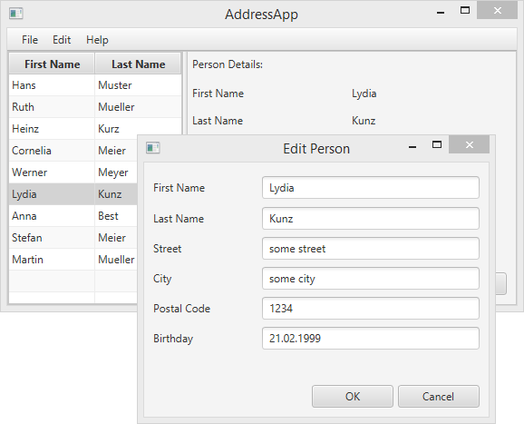
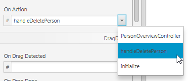
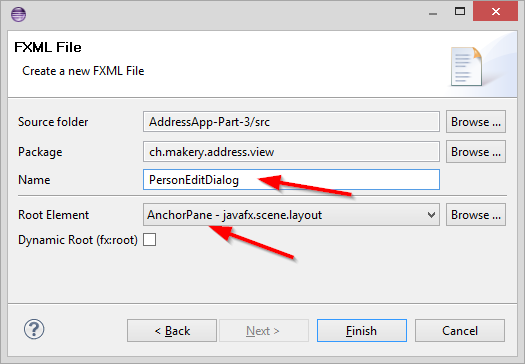
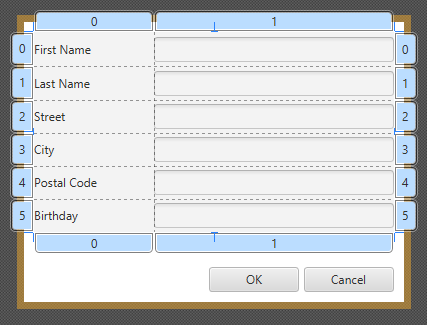

+++
title = "Kısım 3: Kullanıcı ile Etkileşim"
date = 2018-09-03
description = "JavaFX TablView içindeki seçim deiğişimlerine tepki ver. Tablodan çıkarma, ekleme, düzenleme işlemleri yap ve kullanıcı giriini doğrula"
image = "addressapp-part3.png"
prettify = true
comments = true
weight = 3

[[sidebars]]
header = "Kaynakları İndir"
[[sidebars.items]]
text = "<i class=\"fa fa-fw fa-download\"></i> Eclipse projesi olarak Kısım 3 <em>(en az JDK 8u40 gerektirir)</em>"
link = "https://github.com/marcojakob/tutorial-javafx-8/releases/download/v1.1/addressapp-jfx8u40-part-3.zip"
+++

## Kısım 3 teki Bailıklar

* Tablodaki **seçim değişikliklerine tepki ver**.
* **Ekleme**,**Düzenleme** ve **Silme** düğmelerine fonksiyonellik ekle.
* Kişiyi düzenlemek için özel **popup diyalog** oluştur.
* **Kullanıcı girişini doğrula**.

*****

## Tablo Seçimlerine Teki Ver

Açıkçası uygulamamızın sağ tarafını henüz kullanmadık. Yapılacak şey, kullanıcı tablodan bir kişiyi seçtiğinde, o kişinin detaylarını sağ tarafta göstermek.  

İlk olarak, tek bir `Person` bilgileri ile etiketleri dolduracak yeni bir metodu `PersonOverviewController`ierisine ekleyelim.  

`showPersonDetails(Person person)` isimli bir metod oluştur. Bütün etiketleri dolaş ve `setText(...)` kullanarak metinleri kullanıcı detayları ile ayarla. Eğer parametre olarak `null` gelirse, bütün etiketler temizlenmeli. 

##### PersonOverviewController.java

<pre class="prettyprint lang-java">
/**
 * Fills all text fields to show details about the person.
 * If the specified person is null, all text fields are cleared.
 * 
 * @param person the person or null
 */
private void showPersonDetails(Person person) {
    if (person != null) {
        // Fill the labels with info from the person object.
        firstNameLabel.setText(person.getFirstName());
        lastNameLabel.setText(person.getLastName());
        streetLabel.setText(person.getStreet());
        postalCodeLabel.setText(Integer.toString(person.getPostalCode()));
        cityLabel.setText(person.getCity());

        // TODO: We need a way to convert the birthday into a String! 
        // birthdayLabel.setText(...);
    } else {
        // Person is null, remove all the text.
        firstNameLabel.setText("");
        lastNameLabel.setText("");
        streetLabel.setText("");
        postalCodeLabel.setText("");
        cityLabel.setText("");
        birthdayLabel.setText("");
    }
}
</pre>

### Birthday Date'i String'e dönüştür

`birthday`'i `Label`a dönüştüremediğimizi farketmişsinizdir, çünkü tipi `String` değil `LocalDate` tipindedir. İlk olarak tarihi biçimlendirmemiz lazım. 

`LocalDate`'ten `String`'e ve tersine olan dönüşümleri birkaç yerde kullanacağız. Bunun için `static` metodlu yardımcı sınıf oluşturmak iyi alışkanlıklardandır. İsmini `DateUtil` yapacağız ve `ch.makery.address.util` isimli ayrı bir paketin içerisine koyacağız:

##### DateUtil.java

<pre class="prettyprint lang-java">
package ch.makery.address.util;

import java.time.LocalDate;
import java.time.format.DateTimeFormatter;
import java.time.format.DateTimeParseException;

/**
 * Helper functions for handling dates.
 * 
 * @author Marco Jakob
 */
public class DateUtil {
	
	/** The date pattern that is used for conversion. Change as you wish. */
	private static final String DATE_PATTERN = "dd.MM.yyyy";
	
	/** The date formatter. */
	private static final DateTimeFormatter DATE_FORMATTER = 
			DateTimeFormatter.ofPattern(DATE_PATTERN);
	
	/**
     * Returns the given date as a well formatted String. The above defined 
     * {@link DateUtil#DATE_PATTERN} is used.
     * 
     * @param date the date to be returned as a string
     * @return formatted string
     */
    public static String format(LocalDate date) {
        if (date == null) {
            return null;
        }
        return DATE_FORMATTER.format(date);
    }

    /**
     * Converts a String in the format of the defined {@link DateUtil#DATE_PATTERN} 
     * to a {@link LocalDate} object.
     * 
     * Returns null if the String could not be converted.
     * 
     * @param dateString the date as String
     * @return the date object or null if it could not be converted
     */
    public static LocalDate parse(String dateString) {
        try {
        	return DATE_FORMATTER.parse(dateString, LocalDate::from);
        } catch (DateTimeParseException e) {
            return null;
        }
    }

    /**
     * Checks the String whether it is a valid date.
     * 
     * @param dateString
     * @return true if the String is a valid date
     */
    public static boolean validDate(String dateString) {
    	// Try to parse the String.
    	return DateUtil.parse(dateString) != null;
    }
}
</pre>

<strong>Hint:</strong> <code>DATE_PATTERN</code>'ı değiştirerek tarih biçimini değiştirebilirsiniz. Mevcut bütün biçimleri için bakınız <a class="alert-link" href="http://docs.oracle.com/javase/8/docs/api/java/time/format/DateTimeFormatter.html">DateTimeFormatter</a>.

#### DateUtil'i Kullan

Şimdi yeni `DateUtil`'imizi  `PersonOverviewController`'ın `showPersonDetails` metodu içerisinde kullanacağız. Eklediğimiz *TODO*'yu aşağıdaki satırla değiştirin:

<pre class="prettyprint lang-java">
birthdayLabel.setText(DateUtil.format(person.getBirthday()));
</pre>

### Tablo Seçim Değişikliklerini Dinle

Kişi tablosunda kullanıcı bir kişiyi seçtiğinde haberdar olmak için *değişiklikleri dinlememiz* gerekir. 

JavaFX'te tek bir `changed(...)` metodu olan [`ChangeListener`](http://docs.oracle.com/javase/8/javafx/api/) isminde bir arayüz var. Metodun üç parametresi var:  `izlenebilir`, `eskiDeğer`, ve  `yeniDeğer`

Java 8 *lambda expression* kullanarak böyle bir `ChangeListener` (değişim izleyici) oluşturacağız. `PersonOverviewController` içerisindeki `initialize()` metoduna birkaç setır ekleyelim. Şimdi şöyle gözükecek:

##### PersonOverviewController.java

<pre class="prettyprint lang-java">
@FXML
private void initialize() {
    // Initialize the person table with the two columns.
    firstNameColumn.setCellValueFactory(
            cellData -> cellData.getValue().firstNameProperty());
    lastNameColumn.setCellValueFactory(
            cellData -> cellData.getValue().lastNameProperty());

    // Clear person details.
    showPersonDetails(null);

    // Listen for selection changes and show the person details when changed.
    personTable.getSelectionModel().selectedItemProperty().addListener(
            (observable, oldValue, newValue) -> showPersonDetails(newValue));
}
</pre>

`showPersonDetails(null);` ile kişidetaylarını sıfırlıyoruz. 

`personTable.getSelectionModel...` ile kişi tablosunun *selectedItemProperty*'sini alıyoruz ve ona bir dinleyici ekliyoruz. Ne zaman kullanıcı tablodan bir kişi seçse, bizim *lambda expression*'ımız çalışıyor. Yeni seçilen kişiyi alıyoruz ve `showPersonDetails(...)` metoduna veriyoruz.

Bu noktada **uygulamanızı çalıştırma**yı deneyin. Tablodan bir kişi seçtiğinizde, o kişinin detaylarının sağ tarafta gösterildiğini teyit edin.

Eğer birşeyler çalışmazsa, `PersonOverviewController` sınıfınızı [PersonOverviewController.java](PersonOverviewController.java) ile karşılaştırabilirsiniz.  

*****

## Silme Düğmesi

Arayüzümüzde halihzırdabir silme düğmesi var ama bir fonksiyonu yok. *Scene Builder* içerisinden bir düğme için aksiyon seçebiliriz. Controller içerisinde `@FXML` ile işaretlenmiş (ya da public olan) herhangi bir fonksiyon *Scene Builder* tarafından erişilebilirdir. Bu yüüzden ilk olarak `PersonOverviewController` sınıfımızın sonuna bir silme metodu ekleyelim:

##### PersonOverviewController.java

<pre class="prettyprint lang-java">
/**
 * Called when the user clicks on the delete button.
 */
@FXML
private void handleDeletePerson() {
    int selectedIndex = personTable.getSelectionModel().getSelectedIndex();
    personTable.getItems().remove(selectedIndex);
}
</pre>

Şimdi `PersonOverview.fxml` dosyasını *SceneBuilder* içerisinden açın. *Silme* düğmesini seçin, *Code* grubu açın ve **On Action** dropdown listesinden `handleDeletePerson`'ı seçin. 

<strong>Hatırlatma:</strong>FXML dosyasına Scene Builder içerisinden deişiklik yaptıktan sonra,değişikliklerin uygulanması için Eclipseteki projeyi yenileyin. 

### Hata Yönetimi

Eğer bu noktada uygulamayı çalıştırırsanız, seçilen kişiyi tanlodan silebilmeniz gerekir. Ama eğer **seçili bir kişi yokken düğmeye tıklarsanız** ne olacak?  

`ArrayIndexOutOfBoundsException` oluşacaktır çünkü `-1` indisindeki bir kişiyi silemeyecektir. `-1` `getSelectedIndex()` tarafından gönderilir, anlamı seçim yapılmadığıdır. 

Tabi ki böyle bir hatayı gözardı etmek iyi değildir. Kullanıcıyı silme işleminden önce bir kişiyi seçmesi gerekitiği konusunda bilgilendirmeliyiz. ( Daha da iyisi düğmeyi pasif etmektir, böylece kullanıcının yanlış birşey yapma şansı ortadan kalkar). 

`handleDeletePerson()` metoduna yapılan bazı değişiklikler ile, tabloda kişi seçili değilken kullanıcı silme düğmesine bastığında basit bir popup diyalog gösterebiliriz: 

##### PersonOverviewController.java

<pre class="prettyprint lang-java">
/**
 * Kullanıcı silme butonuna bastığında çağırılır.
 */
@FXML
private void handleDeletePerson() {
    int selectedIndex = personTable.getSelectionModel().getSelectedIndex();
    if (selectedIndex >= 0) {
        personTable.getItems().remove(selectedIndex);
    } else {
        // Nothing selected.
        Alert alert = new Alert(AlertType.WARNING);
        alert.initOwner(mainApp.getPrimaryStage());
        alert.setTitle("No Selection");
        alert.setHeaderText("No Person Selected");
        alert.setContentText("Please select a person in the table.");

        alert.showAndWait();
    }
}
</pre>

Dialogların nasıl kullanılacağıyla ilgili daha fazla örnek için <a class="alert-link" href="/blog/javafx-dialogs-official/">JavaFX Dialogs</a> ile ilgili blog postumu okuyabilirsiniz.

*****

## Yeni ve Düzenle Diyalogları

Yeni ve düzenle aksiyonları biraz daha fazla uğraş istiyor: Kullanıcıdan kişi detaylarını almak için gerekli form içeren özel diyaloga (yeni bir sahne anlamına geliyor) ihtiyacımız olacak. 

### Diyalogun Tasarlanması

1. *view* paketi içerisinde `PersonEditDialog.fxml` isminde yeni bir fxml dosyası oluşturun.   

2.  `GridPane`, `Label`lar, `TextField`lar ve `Button` kullanarak aşağıdaki gibi bir diyalog oluşturun.   
   

### Controller'ı oluştur

`PersonEditDialogController.java` olarak Dialog için controller oluşturun:

##### PersonEditDialogController.java

<pre class="prettyprint lang-java pre-scrollable">
package ch.makery.address.view;

import javafx.fxml.FXML;
import javafx.scene.control.Alert;
import javafx.scene.control.Alert.AlertType;
import javafx.scene.control.TextField;
import javafx.stage.Stage;
import ch.makery.address.model.Person;
import ch.makery.address.util.DateUtil;

/**
 * Kişi detaylarını düzenlemek için dialog.
 * 
 * @author Marco Jakob
 */
public class PersonEditDialogController {

    @FXML
    private TextField firstNameField;
    @FXML
    private TextField lastNameField;
    @FXML
    private TextField streetField;
    @FXML
    private TextField postalCodeField;
    @FXML
    private TextField cityField;
    @FXML
    private TextField birthdayField;

    private Stage dialogStage;
    private Person person;
    private boolean okClicked = false;

    /**
     * Initializes the controller class. This method is automatically called
     * after the fxml file has been loaded.
     */
    @FXML
    private void initialize() {
    }

    /**
     * Sets the stage of this dialog.
     * 
     * @param dialogStage
     */
    public void setDialogStage(Stage dialogStage) {
        this.dialogStage = dialogStage;
    }

    /**
     * Sets the person to be edited in the dialog.
     * 
     * @param person
     */
    public void setPerson(Person person) {
        this.person = person;

        firstNameField.setText(person.getFirstName());
        lastNameField.setText(person.getLastName());
        streetField.setText(person.getStreet());
        postalCodeField.setText(Integer.toString(person.getPostalCode()));
        cityField.setText(person.getCity());
        birthdayField.setText(DateUtil.format(person.getBirthday()));
        birthdayField.setPromptText("dd.mm.yyyy");
    }

    /**
     * Returns true if the user clicked OK, false otherwise.
     * 
     * @return
     */
    public boolean isOkClicked() {
        return okClicked;
    }

    /**
     * Called when the user clicks ok.
     */
    @FXML
    private void handleOk() {
        if (isInputValid()) {
            person.setFirstName(firstNameField.getText());
            person.setLastName(lastNameField.getText());
            person.setStreet(streetField.getText());
            person.setPostalCode(Integer.parseInt(postalCodeField.getText()));
            person.setCity(cityField.getText());
            person.setBirthday(DateUtil.parse(birthdayField.getText()));

            okClicked = true;
            dialogStage.close();
        }
    }

    /**
     * Called when the user clicks cancel.
     */
    @FXML
    private void handleCancel() {
        dialogStage.close();
    }

    /**
     * Validates the user input in the text fields.
     * 
     * @return true if the input is valid
     */
    private boolean isInputValid() {
        String errorMessage = "";

        if (firstNameField.getText() == null || firstNameField.getText().length() == 0) {
            errorMessage += "No valid first name!\n"; 
        }
        if (lastNameField.getText() == null || lastNameField.getText().length() == 0) {
            errorMessage += "No valid last name!\n"; 
        }
        if (streetField.getText() == null || streetField.getText().length() == 0) {
            errorMessage += "No valid street!\n"; 
        }

        if (postalCodeField.getText() == null || postalCodeField.getText().length() == 0) {
            errorMessage += "No valid postal code!\n"; 
        } else {
            // try to parse the postal code into an int.
            try {
                Integer.parseInt(postalCodeField.getText());
            } catch (NumberFormatException e) {
                errorMessage += "No valid postal code (must be an integer)!\n"; 
            }
        }

        if (cityField.getText() == null || cityField.getText().length() == 0) {
            errorMessage += "No valid city!\n"; 
        }

        if (birthdayField.getText() == null || birthdayField.getText().length() == 0) {
            errorMessage += "No valid birthday!\n";
        } else {
            if (!DateUtil.validDate(birthdayField.getText())) {
                errorMessage += "No valid birthday. Use the format dd.mm.yyyy!\n";
            }
        }

        if (errorMessage.length() == 0) {
            return true;
        } else {
            // Show the error message.
            Alert alert = new Alert(AlertType.ERROR);
            alert.initOwner(dialogStage);
            alert.setTitle("Invalid Fields");
            alert.setHeaderText("Please correct invalid fields");
            alert.setContentText(errorMessage);
            
            alert.showAndWait();
            
            return false;
        }
    }
}
</pre>

Bu controller ile ilgili birkaç not:

* Düzenlenecek kişiyi ayarlamak için`setPerson(...)` metodu başka bir sınıftan çağırılabilir. 
* Kullanıcı OK düğmesine bastığında `handleOk()` metodu çağırılır. İlk olarak `isInputValid()` metodu çağırılarak bazı doğrulamalar yapılır. Sadece doğrulama başarılı ise kişi nesnesi kullanıcının girdiği verilerle doldurulur. Bu değişiklikler `setPerson(...)` metoduna gönderilen kişi nesnesine doğrudan uygulanır!
* Boolean `okClicked` çağıranın, kullanıcının OK ya da Cancel butonunlarından hangisine bastığını anlaması için kullanıldı. 

### View ve Controller Bağlantısı 

View (FXML) ve controller oluşturuldu, bunları birbirine bağlamamız lazım::

1. `PersonEditDialog.fxml`'i aç.
2. Soldaki *Controller* grup içerisinde controller sınıfı olarak `PersonEditDialogController`'ı seç.  
3. `TextField`'ların **fx:id**'lerini controllerdaki karşılık gelen alanlara ayarla. 
4. İki düğmenin **onAction**'larını karı gelen yönetici metodlara ayarla. 

### Dialogun Açılması

`MainApp` içerisinde kişi düzenleme diyalogunu yükleyen ve gösteren metodu ekleyin:   

##### MainApp.java

<pre class="prettyprint lang-java">
/**
 * Opens a dialog to edit details for the specified person. If the user
 * clicks OK, the changes are saved into the provided person object and true
 * is returned.
 * 
 * @param person the person object to be edited
 * @return true if the user clicked OK, false otherwise.
 */
public boolean showPersonEditDialog(Person person) {
    try {
        // Load the fxml file and create a new stage for the popup dialog.
        FXMLLoader loader = new FXMLLoader();
        loader.setLocation(MainApp.class.getResource("view/PersonEditDialog.fxml"));
        AnchorPane page = (AnchorPane) loader.load();

        // Create the dialog Stage.
        Stage dialogStage = new Stage();
        dialogStage.setTitle("Edit Person");
        dialogStage.initModality(Modality.WINDOW_MODAL);
        dialogStage.initOwner(primaryStage);
        Scene scene = new Scene(page);
        dialogStage.setScene(scene);

        // Set the person into the controller.
        PersonEditDialogController controller = loader.getController();
        controller.setDialogStage(dialogStage);
        controller.setPerson(person);

        // Show the dialog and wait until the user closes it
        dialogStage.showAndWait();

        return controller.isOkClicked();
    } catch (IOException e) {
        e.printStackTrace();
        return false;
    }
}
</pre>

`PersonOverviewController`'a aşağıdaki metodu ekleyin. Kullanıcı *new* ya da *edit* düğmelerine bastığında,bu metodlar `MainApp`'ten `showPersonEditDialog(...)`'u çağırır.      

##### PersonOverviewController.java

<pre class="prettyprint lang-java">
/**
 * Called when the user clicks the new button. Opens a dialog to edit
 * details for a new person.
 */
@FXML
private void handleNewPerson() {
    Person tempPerson = new Person();
    boolean okClicked = mainApp.showPersonEditDialog(tempPerson);
    if (okClicked) {
        mainApp.getPersonData().add(tempPerson);
    }
}

/**
 * Called when the user clicks the edit button. Opens a dialog to edit
 * details for the selected person.
 */
@FXML
private void handleEditPerson() {
    Person selectedPerson = personTable.getSelectionModel().getSelectedItem();
    if (selectedPerson != null) {
        boolean okClicked = mainApp.showPersonEditDialog(selectedPerson);
        if (okClicked) {
            showPersonDetails(selectedPerson);
        }

    } else {
        // Nothing selected.
        Alert alert = new Alert(AlertType.WARNING);
        alert.initOwner(mainApp.getPrimaryStage());
        alert.setTitle("No Selection");
        alert.setHeaderText("No Person Selected");
        alert.setContentText("Please select a person in the table.");

        alert.showAndWait();
    }
}
</pre>

`PersonOverview.fxml` dosyasını Scene Builder ile açın. Yeni ve Düzenle düğmeleri için *On Action*'da karşılık gelen metdoları seçin.  

*****

## Bitti!

Şimdi çalışır durumda bir *Adres Uygulama* nız olması gerekir. Uygulama kişileri ekleyebilir, düzenleyebilir ve silebilir. Hatta kötü kullanıcı girişlerini engellemek için bazı doğrulamalar bile var.

Umarım bu uygulamanın konsepti ve yapısı sizin kendi JavaFX uygulamanızı yazmanıza başlamak için yardımcı olur! 

### Sırada Ne Var?

[Tutorial Kısım 4](/tr/library/javafx-tutorial/part4/) CSS biçimlendirme ekleyeceğiz.

##### İlginç bulabileceğiniz diğer bazı makaleler

* [JavaFX Dialogs (official)](/blog/javafx-dialogs-official/)
* [JavaFX Date Picker](/blog/javafx-8-date-picker/)
* [JavaFX Event Handling Examples](/blog/javafx-8-event-handling-examples/)
* [JavaFX TableView Sorting and Filtering](/blog/javafx-8-tableview-sorting-filtering/)
* [JavaFX TableView Cell Renderer](/blog/javafx-8-tableview-cell-renderer/)
