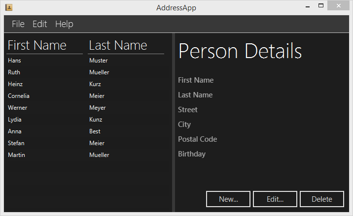
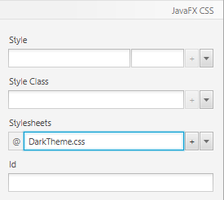
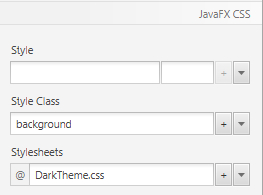
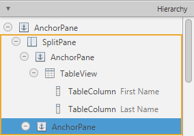
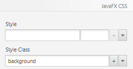
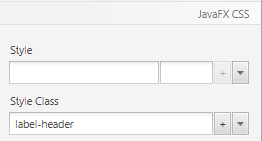
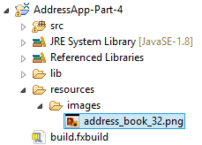

+++
title = "Kısım 4: CSS Biçimlendirme"
date = 2018-09-04
description = "JavaFX'te kendi kullanıcı arayüzünüzü CSS ile biçimlendirebilirsiniz. Bu kısımda ayrıca uygulama ikonu da ekleyeceğiz."
image = "addressapp-part4.png"
prettify = true
comments = true
weight = 4

[[sidebars]]
header = "Kaynakları İndir"
[[sidebars.items]]
text = "<i class=\"fa fa-fw fa-download\"></i> Eclipse Projesi olarak Kısım 4 <em>(en az JDK 8u40 gerektirir)</em>"
link = "https://github.com/marcojakob/tutorial-javafx-8/releases/download/v1.1/addressapp-jfx8u40-part-4.zip"
+++

## Kısım 4'teki Başlıklar

* **CSS Biçimlendirme**
* **Uygulama İkonu** ekleme

*****

## CSS Biçimlendirme 

JavaFX'te kendi kullanıcı arayüzünüzü Kaskat Biçimlendirme Sayfaları (CSS) kullanarak biçimlendirebilirsiniz. Bu harika! Bir java uygulamasının görünümünü özelleştirmek hiç bu kadar kolay olmamıştı. 

Bu tutorial'da windows 8 metro tasarımından esinlenmiş bir *DarkTheme* oluşturacağız. Düğmelerin css'leri Pedro Duque Vieira'nın [JMetro - Windows 8 Metro controls on Java](http://pixelduke.wordpress.com/2012/10/23/jmetro-windows-8-controls-on-java/) blog postuna dayanıyor.

### CSS ile Aşina Olmak 

JavaFX uygulamanızı biçimlendirmek için genel olarak CSS hakkında temel bilgiye sahip olmanız gerekir. Başlamak için iyi bir nokta bu tutorial'dır: [CSS tutorial](http://www.csstutorial.net/).

CSS hakkında daha fazla JavaFX'e özel bilgi için:

* [JavaFX Uygulamalarını CSS ile Giydirmek](http://docs.oracle.com/javase/8/javafx/user-interface-tutorial/css_tutorial.htm) - Tutorial by Oracle
* [JavaFX CSS Referans](http://docs.oracle.com/javase/8/javafx/api/javafx/scene/doc-files/cssref.html) - Official Reference

### Varsayılan JavaFX CSS

JavaFX 8'de varsayılan CSS biçimi **`modena.css`** ismindeki dosyadır. Bu dosya Java klasöründe `/jdk1.8.x/jre/lib/ext/jfxrt.jar` altında bulunabilecek olan `jfxrt.jar` Java FX jar dosyası içerisinde bulunabilir. 

`jfxrt.jar` doyasını çıkartın (unzip). `modena.css` dosyasını `com/sun/javafx/scene/control/skin/modena/` altında bulabilirsiniz. 

Bu varsayılan biçimlendirme sayfası her zaman JavaFX uygulamasına uygulanır. Özel bir biçimlendirme dosyası ekleyerek `modena.css`'nin varsayılan biçimlerinin yerine kullanabiliriz.   

<strong>İpucu:</strong> Hangi biçimlendirmelerin yerine yenisini kullanabileceğinizi görmek için varsayılan CSS dosyasına bakmak faydalı olacaktır. 

### CSS Biçimlendirme Sayfalarını Eklemek

Aşağıdaki `DarkTheme.css` isimli CSS dosyasını *view* paketine ekleyin. 

##### DarkTheme.css

<pre class="prettyprint lang-css pre-scrollable">
.background {
    -fx-background-color: #1d1d1d;
}

.label {
    -fx-font-size: 11pt;
    -fx-font-family: "Segoe UI Semibold";
    -fx-text-fill: white;
    -fx-opacity: 0.6;
}

.label-bright {
    -fx-font-size: 11pt;
    -fx-font-family: "Segoe UI Semibold";
    -fx-text-fill: white;
    -fx-opacity: 1;
}

.label-header {
    -fx-font-size: 32pt;
    -fx-font-family: "Segoe UI Light";
    -fx-text-fill: white;
    -fx-opacity: 1;
}

.table-view {
    -fx-base: #1d1d1d;
    -fx-control-inner-background: #1d1d1d;
    -fx-background-color: #1d1d1d;
    -fx-table-cell-border-color: transparent;
    -fx-table-header-border-color: transparent;
    -fx-padding: 5;
}

.table-view .column-header-background {
    -fx-background-color: transparent;
}

.table-view .column-header, .table-view .filler {
    -fx-size: 35;
    -fx-border-width: 0 0 1 0;
    -fx-background-color: transparent;
    -fx-border-color: 
        transparent
        transparent
        derive(-fx-base, 80%) 
        transparent;
    -fx-border-insets: 0 10 1 0;
}

.table-view .column-header .label {
    -fx-font-size: 20pt;
    -fx-font-family: "Segoe UI Light";
    -fx-text-fill: white;
    -fx-alignment: center-left;
    -fx-opacity: 1;
}

.table-view:focused .table-row-cell:filled:focused:selected {
    -fx-background-color: -fx-focus-color;
}

.split-pane:horizontal > .split-pane-divider {
    -fx-border-color: transparent #1d1d1d transparent #1d1d1d;
    -fx-background-color: transparent, derive(#1d1d1d,20%);
}

.split-pane {
    -fx-padding: 1 0 0 0;
}

.menu-bar {
    -fx-background-color: derive(#1d1d1d,20%);
}

.context-menu {
    -fx-background-color: derive(#1d1d1d,50%);
}

.menu-bar .label {
    -fx-font-size: 14pt;
    -fx-font-family: "Segoe UI Light";
    -fx-text-fill: white;
    -fx-opacity: 0.9;
}

.menu .left-container {
	-fx-background-color: black;
}

.text-field {
    -fx-font-size: 12pt;
    -fx-font-family: "Segoe UI Semibold";
}

/* 
 * Metro style Push Button
 * Author: Pedro Duque Vieira
 * http://pixelduke.wordpress.com/2012/10/23/jmetro-windows-8-controls-on-java/
 */
.button {
    -fx-padding: 5 22 5 22;   
    -fx-border-color: #e2e2e2;
    -fx-border-width: 2;
    -fx-background-radius: 0;
    -fx-background-color: #1d1d1d;
    -fx-font-family: "Segoe UI", Helvetica, Arial, sans-serif;
    -fx-font-size: 11pt;
    -fx-text-fill: #d8d8d8;
    -fx-background-insets: 0 0 0 0, 0, 1, 2;
}

.button:hover {
    -fx-background-color: #3a3a3a;
}

.button:pressed, .button:default:hover:pressed {
  -fx-background-color: white;
  -fx-text-fill: #1d1d1d;
}

.button:focused {
    -fx-border-color: white, white;
    -fx-border-width: 1, 1;
    -fx-border-style: solid, segments(1, 1);
    -fx-border-radius: 0, 0;
    -fx-border-insets: 1 1 1 1, 0;
}

.button:disabled, .button:default:disabled {
    -fx-opacity: 0.4;
    -fx-background-color: #1d1d1d;
    -fx-text-fill: white;
}

.button:default {
    -fx-background-color: -fx-focus-color;
    -fx-text-fill: #ffffff;
}

.button:default:hover {
    -fx-background-color: derive(-fx-focus-color,30%);
}
</pre>

Şimdi CSS mizi görüntümüze (Scene) eklememiz lazım. Java kodunda program ile bunu yapabiliriz, ancak fxml dosyalarımıza eklemek için Scene Builder'ı kullanacağız:  

#### CSS'yi RootLayout.fxml'e ekle

1. `RootLayout.fxml` dosyasını Scene Builder ile açın. 

2. Hierarchy görünümünde `BorderPane` kökünü seçin. *Properties* grubu altında biçimlendirme dosyası olarak `DarkTheme.css`'yi ekleyin.   

#### CSS'yi PersonEditDialog.fxml'e ekle

1. `PersonEditDialog.fxml` dosyasını Scene Builder ile açın. `AnchorPane` kökünü seçin ve *Properties* grubu altında biçimlendirme dosyası olarak `DarkTheme.css`'yi seçin. 

2. Arkaplan hala beyaz, o halde `AnchorPane` köküne `background` biçim sınıfını ekleyin. 

3. OK düğmesini seçin ve Properties görünümünde *Default Button*'ı seçin. Bu rengini değiştirir ve kullanıcı tarafından *enter* tuşuna basıldığında varsayılan düğme yapar.  

#### CSS'yi PersonOverview.fxml'e ekle

1. `PersonOverview.fxml` dosyasını Scene Builder ile açın. *Hierarchy* grubunda `AnchorPane` kökünü seçin. Properties altında `DarkTheme.css`'yi biçim dosyası olarak ekleyin. 

2. Şimdi bazı değişiklikler görmeniz lazım. Tablo ve düğmeler siyah. `modena.css`'deki tüm `.table-view` ve `.button` sınıf biçimlendirmeleri tabloya ve düğmelere uygulanıyor. Özel CSS'mizde bu biçimlerden bazılarını yeniden tanımladığımız ( ve böylece geçersiz kıldığımız) için yeni biçimler otomatik olarak uygulandı.  

3. Metinlerin tamamının görüntülenmesi için düğme boyutlarını yeniden ayarlamanız gerekebilir. 

4. Sağ `AnchorPane`'i seçin, bu `SplitPane` içerisindedir.   
   

5. *Properties* grubuna gidin ve biçim sınıfı olarak `background`'u seçin. Arkaplan şimdi siyaha dönmeli. 

#### Farklı Biçimlerdeki Etiketler

Şu anda sağ taraftaki tüm etiketler aynı boyutta. Halizhazırda css dosyası içerisinde, etiketleri biçimlendirmede kullanacağımız `.label-header` ve `.label-bright` isimli biçimler tanımlıdır. 

1. *Person Details* etiketini seçin ve Style Class olarak `label-header`'ı ekleyin.

2. Sağ sütundaki her bir etiket için ( kişi detay bilgilerinin gösterildiği taraf), `label-bright` Style Class'ı ekleyin.

*****

## Uygulama İkonu Eklemek

Şu anda başlık çubuğunda ve görev çubuğunda uygulamamızın varsayılan ikonu bulunmaktadır:

Özel ikon ile daha iyi gözüküyor:

### İkon Dosyası

Ücretsiz ikon alabileceiniz yerlerden birisi [Icon Finder](http://www.iconfinder.com). Küçük bir [adres defteri ikonu](https://www.iconfinder.com/icons/86957/address_book_icon#size=32) indirdim.

AddressApp projenizin içerisine **resources** isminde (normal) bir klasör açın ve onun içine **images** isminde alt klasör açın. Seçtiğiniz ikonu images klasörü içerisine koyun. Klasör yapınız şimdi şuna benzemeli: 

### Görüntüye (Scene) İkon Belirle

Görüntümüz için ikon belirlemek için `MainApp.java` içerisindeki `start(...)` metoduna aşağıdaki satırı ekleyin:

##### MainApp.java

<pre class="prettyprint lang-java">
this.primaryStage.getIcons().add(new Image("file:resources/images/address_book_32.png"));
</pre>

`start(...)` metodunun tamamı şimdi şu şekilde olmalı:

<pre class="prettyprint lang-java">
public void start(Stage primaryStage) {
    this.primaryStage = primaryStage;
    this.primaryStage.setTitle("AddressApp");

    // Set the application icon.
    this.primaryStage.getIcons().add(new Image("file:resources/images/address_book_32.png"));

    initRootLayout();

    showPersonOverview();
}
</pre>

Tabi ki kişi düzenleme dialog sahnesine de ikon ekleyebilirsiniz.

### Sırada Ne Var?

[Tutorial Kısım 5](/tr/library/javafx-tutorial/part5/)'te verimiz için XML depolama ekleyeceğiz. 

##### İlginç bulabileceğiniz bazı diğer makaleler

* [JavaFX Dialogs (official)](/blog/javafx-dialogs-official/)
* [JavaFX Date Picker](/blog/javafx-8-date-picker/)
* [JavaFX Event Handling Examples](/blog/javafx-8-event-handling-examples/)
* [JavaFX TableView Sorting and Filtering](/blog/javafx-8-tableview-sorting-filtering/)
* [JavaFX TableView Cell Renderer](/blog/javafx-8-tableview-cell-renderer/)
