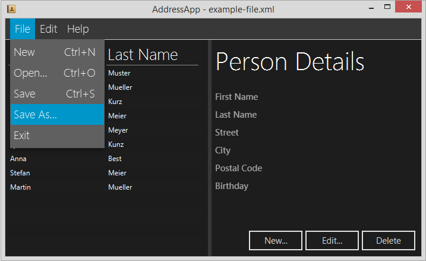
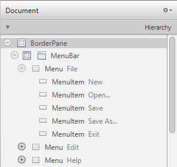

+++
title = "Kısım 5: Veriyi XML Olarak Depolamak"
date = 2018-09-05
description = "Veriyi JAXB ile XML olarak saklama. JavaFX FileChooser ve JavaFX Menu kullanımını öğrenme."
image = "addressapp-part5.png"
prettify = true
comments = true
weight = 5

[[sidebars]]
header = "Download Sources"
[[sidebars.items]]
text = "<i class=\"fa fa-fw fa-download\"></i> Eclipse Projesi olarak kısım 5 <em>(en az JDK 8u40 gerektirir)</em>"
link = "https://github.com/marcojakob/tutorial-javafx-8/releases/download/v1.1/addressapp-jfx8u40-part-5.zip"
+++

## Kısım 5 Başlıkları

* **Veriyi XML olarak Kalıcı Hale Getirme**
* JavaFX **FileChooser** Kullanma
* JavaFX **Menu** Kullanma
* Son açılan dosya yolunu **user preferences** içerisine saklama 

*****

Halihzırda adres uygulamamızın verileri sadece hafızada durmaktadır. Uygulamayı her kapattığımızda veriler kayboluyor. O zaman veriyi kalıcı olarak kaydetmeyi düşünme zamanı geldi. 

## Kullanıcı Tercihlerini Kaydetme

Java `Preferences` isimli bir sınıf ile bazı uygulama durumlarını kaydetmemize imkan veriyor. İşletim sistemine bağlı olarak `Preferences` farklı konumlarda saklanıyor (ör. Windows'ta kayıt dosyası) .

Tüm adres defterimizi kaydetmek için `Preferences`'i kullanamayacağız. Ama bizim **bazı uygulama durumlarını kaydetmemize** imkan veriyor. Bunlardan birisi **son aşılan dosyanın yolu**. Bu bilgiyle kullanıcı uygulamayı her yeniden başlattığında son uygulama durumunu geri yükleyebiliriz. 

Aşaıdaki iki metod Preferences'i kaydetmeyi ve tekrar geri getirmeyi yönetiyor. Bunları `MainApp` sınıfınızın sonuna ekleyin: 

##### MainApp.java

<pre class="prettyprint lang-java">
/**
 * Returns the person file preference, i.e. the file that was last opened.
 * The preference is read from the OS specific registry. If no such
 * preference can be found, null is returned.
 * 
 * @return
 */
public File getPersonFilePath() {
    Preferences prefs = Preferences.userNodeForPackage(MainApp.class);
    String filePath = prefs.get("filePath", null);
    if (filePath != null) {
        return new File(filePath);
    } else {
        return null;
    }
}

/**
 * Sets the file path of the currently loaded file. The path is persisted in
 * the OS specific registry.
 * 
 * @param file the file or null to remove the path
 */
public void setPersonFilePath(File file) {
    Preferences prefs = Preferences.userNodeForPackage(MainApp.class);
    if (file != null) {
        prefs.put("filePath", file.getPath());

        // Update the stage title.
        primaryStage.setTitle("AddressApp - " + file.getName());
    } else {
        prefs.remove("filePath");

        // Update the stage title.
        primaryStage.setTitle("AddressApp");
    }
}
</pre>

## Veriyi XML Olarak Kalıcı Hale Getirmek

### Neden XML?

Veriyi kalıcı hale getirmenin en bilinen yollarından birisi veritabanı kullanımıdır. Veritabanları genelde bir çeşit ilişkisel veri (tablolar gibi) içerirken bizim kaydetmek istediğimiz veriler nesnelerdir. Bu durum [nesne-ilişkisel empedans uyumsuzluğu](http://wikipedia.org/wiki/Object-relational_impedance_mismatch) olarak bilinir. Nesneleri ilişkisel veritabanı tabloları ile eşleştirmek ciddi bir iş gerektirir. Elşeltirmeye yardımcı olan bazı çatılar var (ör. [Hibernate](http://www.hibernate.org/), en popüler olanı) ama yine de kurulması çok ciddi bir iş gerektiriyor.  

Bizim basit veri modelimiz için XML kullanmak çok daha basittir. [JAXB](https://jaxb.java.net/) (**J**ava **A**rchitecture for **X**ML **B**inding) isminde bir kütüphane kullanacağız. Birkaç satır kod ile JAXB bizim aşağıdaki gibi XML çıktısı üretmemizi sağlayacak:

##### Örnek xml çıktı

<pre class="prettyprint lang-xml">
&lt;persons&gt;
    &lt;person&gt;
        &lt;birthday&gt;1999-02-21&lt;/birthday&gt;
        &lt;city&gt;some city&lt;/city&gt;
        &lt;firstName&gt;Hans&lt;/firstName&gt;
        &lt;lastName&gt;Muster&lt;/lastName&gt;
        &lt;postalCode&gt;1234&lt;/postalCode&gt;
        &lt;street&gt;some street&lt;/street&gt;
    &lt;/person&gt;
    &lt;person&gt;
        &lt;birthday&gt;1999-02-21&lt;/birthday&gt;
        &lt;city&gt;some city&lt;/city&gt;
        &lt;firstName&gt;Anna&lt;/firstName&gt;
        &lt;lastName&gt;Best&lt;/lastName&gt;
        &lt;postalCode&gt;1234&lt;/postalCode&gt;
        &lt;street&gt;some street&lt;/street&gt;
    &lt;/person&gt;
&lt;/persons&gt;
</pre>

### JAXB Kullanımı

JAXB halihazırda JDK içerisinde var. Bunun anlamı bizim ilave bir kütüphane eklememize gerek yoktur. 

JAXB iki temel özellik sunar: Java nesnelerini XML e **dönüştürmek** ve XML i tekrar Java nesnelerine **geri dönüştürmek**.

JAXB'nin dönüşümü yapabilmesi için modelimizi hazırlamalıyız. 

#### JAXB için Model Sınıfını Hazırlamak 

Kaydetmek istediğimiz veri `MainApp` sınıfımız içerisindeki `personData` değişkeni içerisinde bulunuyor. JAXB en üst sınıfın `@XmlRootElement` ile işaretlenmesini gerektirir. `personData` `ObservableList` sınıfındandır ve biz `ObservableList`'e herhangi bir işaretleme yapamayız. Bu yüzden XML olarak saklamak için sadece bizim `Persons` listemizi tutacak başka bir sınıf oluşturmamız gerekiyor. 

Oluşturacağımız yeni sınıfın ismi `PersonListWrapper` ve `ch.makery.address.model` ppaketinin içerisine konuyor. 

##### PersonListWrapper.java

<pre class="prettyprint lang-java">
package ch.makery.address.model;

import java.util.List;

import javax.xml.bind.annotation.XmlElement;
import javax.xml.bind.annotation.XmlRootElement;

/**
 * Helper class to wrap a list of persons. This is used for saving the
 * list of persons to XML.
 * 
 * @author Marco Jakob
 */
@XmlRootElement(name = "persons")
public class PersonListWrapper {

	private List&lt;Person> persons;

	@XmlElement(name = "person")
	public List&lt;Person> getPersons() {
		return persons;
	}

	public void setPersons(List&lt;Person> persons) {
		this.persons = persons;
	}
}
</pre>

Şu iki işaretlemeye dikkat edin:: 

* `@XmlRootElement` kök elemanın ismini tanımlar.
* `@XmlElement` eleman için belirleyebileceiğimiz tercihe bağlı isim.

#### JAXB ile Veri Okuma ve Yazma

`MainApp` sınıfımızı kişi verilerini okuma ve yazmadan sorumlu yapacağız. `MainApp.java`'nın sonuna aşağıdaki iki metodu ekleyin: 

<pre class="prettyprint lang-java">
/**
 * Belirtilen dosyadan kişi verilerini yükler. Mevcut kişi verileri değiştirilir. 
 * 
 * @param file
 */
public void loadPersonDataFromFile(File file) {
    try {
        JAXBContext context = JAXBContext
                .newInstance(PersonListWrapper.class);
        Unmarshaller um = context.createUnmarshaller();

        // Reading XML from the file and unmarshalling.
        PersonListWrapper wrapper = (PersonListWrapper) um.unmarshal(file);

        personData.clear();
        personData.addAll(wrapper.getPersons());

        // Save the file path to the registry.
        setPersonFilePath(file);

    } catch (Exception e) { // catches ANY exception
        Alert alert = new Alert(AlertType.ERROR);
        alert.setTitle("Error");
        alert.setHeaderText("Could not load data");
        alert.setContentText("Could not load data from file:\n" + file.getPath());

        alert.showAndWait();
    }
}

/**
 * Mevcut kişi verisi belirtilen dosyaya kaydeder.
 * 
 * @param file
 */
public void savePersonDataToFile(File file) {
    try {
        JAXBContext context = JAXBContext
                .newInstance(PersonListWrapper.class);
        Marshaller m = context.createMarshaller();
        m.setProperty(Marshaller.JAXB_FORMATTED_OUTPUT, true);

        // Wrapping our person data.
        PersonListWrapper wrapper = new PersonListWrapper();
        wrapper.setPersons(personData);

        // Marshalling and saving XML to the file.
        m.marshal(wrapper, file);

        // Save the file path to the registry.
        setPersonFilePath(file);
    } catch (Exception e) { // catches ANY exception
        Alert alert = new Alert(AlertType.ERROR);
        alert.setTitle("Error");
        alert.setHeaderText("Could not save data");
        alert.setContentText("Could not save data to file:\n" + file.getPath());

        alert.showAndWait();
    }
}
</pre>

Dönüştürme/GeriDönüştürme hazır. Şimdi kullanabilmek için kaydet/yükle menüsü hazırlayalım.

## Menu İşlemlerini Kullanma

`RootLayout.fxml` içerisinde zaten bir menü var ancak bir henüz kullanmadır. Menüye işlem eklemeden önce tüm menü maddelerini ekleyelim. 

`RootLayout.fxml` dosyasını Scene Builder ile aç ve *library* grubundan gerekli menü maddelerini *hierarchy* grubundaki `MenuBar` çubuğuna sürükle. Open the **New**, **Open...**, **Save**, **Save As...**, ve **Exit** menü maddelerini oluştur. 

İpucu: *Properties* grubu altındaki *Accelerator* ayarını kullanarak menü maddelerine kısayol oluşturabilirsiniz.  

### RootLayoutController

Menü işlemlerini yönetmek için yeni bir controller sınıfına ihtiyacımız var. `ch.makery.address.view` controller paketi içerisinde `RootLayoutController` sınıfını oluşturun.  

Aşağıdaki içeriği controller'a ekleyin: 

##### RootLayoutController.java

<pre class="prettyprint lang-java pre-scrollable">
package ch.makery.address.view;

import java.io.File;

import javafx.fxml.FXML;
import javafx.scene.control.Alert;
import javafx.scene.control.Alert.AlertType;
import javafx.stage.FileChooser;
import ch.makery.address.MainApp;

/**
 * The controller for the root layout. The root layout provides the basic
 * application layout containing a menu bar and space where other JavaFX
 * elements can be placed.
 * 
 * @author Marco Jakob
 */
public class RootLayoutController {

    // Reference to the main application
    private MainApp mainApp;

    /**
     * Is called by the main application to give a reference back to itself.
     * 
     * @param mainApp
     */
    public void setMainApp(MainApp mainApp) {
        this.mainApp = mainApp;
    }

    /**
     * Creates an empty address book.
     */
    @FXML
    private void handleNew() {
        mainApp.getPersonData().clear();
        mainApp.setPersonFilePath(null);
    }

    /**
     * Opens a FileChooser to let the user select an address book to load.
     */
    @FXML
    private void handleOpen() {
        FileChooser fileChooser = new FileChooser();

        // Set extension filter
        FileChooser.ExtensionFilter extFilter = new FileChooser.ExtensionFilter(
                "XML files (*.xml)", "*.xml");
        fileChooser.getExtensionFilters().add(extFilter);

        // Show open file dialog
        File file = fileChooser.showOpenDialog(mainApp.getPrimaryStage());

        if (file != null) {
            mainApp.loadPersonDataFromFile(file);
        }
    }

    /**
     * Saves the file to the person file that is currently open. If there is no
     * open file, the "save as" dialog is shown.
     */
    @FXML
    private void handleSave() {
        File personFile = mainApp.getPersonFilePath();
        if (personFile != null) {
            mainApp.savePersonDataToFile(personFile);
        } else {
            handleSaveAs();
        }
    }

    /**
     * Opens a FileChooser to let the user select a file to save to.
     */
    @FXML
    private void handleSaveAs() {
		FileChooser fileChooser = new FileChooser();

		// Set extension filter
		FileChooser.ExtensionFilter extFilter = new FileChooser.ExtensionFilter(
				"XML files (*.xml)", "*.xml");
		fileChooser.getExtensionFilters().add(extFilter);

		// Show save file dialog
		File file = fileChooser.showSaveDialog(mainApp.getPrimaryStage());

		if (file != null) {
			// Make sure it has the correct extension
			if (!file.getPath().endsWith(".xml")) {
				file = new File(file.getPath() + ".xml");
			}
			mainApp.savePersonDataToFile(file);
		}
	}

    /**
     * Opens an about dialog.
     */
    @FXML
    private void handleAbout() {
    	Alert alert = new Alert(AlertType.INFORMATION);
    	alert.setTitle("AddressApp");
    	alert.setHeaderText("About");
    	alert.setContentText("Author: Marco Jakob\nWebsite: http://code.makery.ch");

    	alert.showAndWait();
    }

    /**
     * Closes the application.
     */
    @FXML
    private void handleExit() {
        System.exit(0);
    }
}
</pre>

#### FileChooser

Yukarıdaki `RootLayoutController` içerisindeki `FileChooser` sınıfı kullanımının not edin. İlk olarak `FileChooser` sınıfından yeni bir nesne oluşturuldu. Sonra sadece  `.xml` ile biten dosyaların görüntülenmesi için bir uzantı filtresi eklendi. Son olarak dosya seçici ana sahnenin en üstünde gösterildi. 

Eğer kullanıcı herhangi bir dosya seçmeden dialogu kapatırsa `null` gönderilir. Aksi halde seçilen dosyayı alırız ve bunu `MainApp`'in `loadPersonDataFromFile(...)` ya da `savePersonDataToFile(...)` metoduna göndeririz. 

### fxml View'i Controller'a Bağlamak 

1. `RootLayout.fxml`i Scene Builder'da açın. *Controller* grubunda Controller sınıfı olarak `RootLayoutController`'ı seçin.

2. *Hierarchy* grubuna geri gidip ve bir menü maddesi seçin. **On Action** altındaki *Code* grubunda tüm kullanılabilir controllermetdolarını görmelisiniz. Her menü maddesi için karşılık gelen metodu seçin.   

3. Her bir menü maddesi için adımları tekrar edin.

4. Sece Builder'ı kapatın ve projenin kök dosyasında **Yenile (F5)**'ye basın. Böylece Eclipse, Scene Builder ile yaptığınız değişikliklerden haberdar olur.

### MainApp ve RootLayoutController'ı Bağlamak

Birkaç farklı yerde `RootLayoutController`'ın  tekrar `MainApp`'e referansa ihtiyacı var. Referansı henüz `RootLayoutController`'a göndermedik.    

`MainApp` sınıfını açın ve `initRootLayout()`metodunu aşağıdaki kodla değiştirin: 

<pre class="prettyprint lang-java">
/**
 * Initializes the root layout and tries to load the last opened
 * person file.
 */
public void initRootLayout() {
    try {
        // Load root layout from fxml file.
        FXMLLoader loader = new FXMLLoader();
        loader.setLocation(MainApp.class
                .getResource("view/RootLayout.fxml"));
        rootLayout = (BorderPane) loader.load();

        // Show the scene containing the root layout.
        Scene scene = new Scene(rootLayout);
        primaryStage.setScene(scene);

        // Give the controller access to the main app.
        RootLayoutController controller = loader.getController();
        controller.setMainApp(this);

        primaryStage.show();
    } catch (IOException e) {
        e.printStackTrace();
    }

    // Try to load last opened person file.
    File file = getPersonFilePath();
    if (file != null) {
        loadPersonDataFromFile(file);
    }
}
</pre>

İki değişikliğe dikkat edin: *controllera main app erişimi veren* satırlar ve *son açılan kişi dosyasını yükleyen* son üç satır. 

### Test

Uygulamanızın test aşamasında kişi verisini bir dosyaya kaydetmek için menüleri kullanabiliyor olmanız gerekir. 

`xml` dosyasını bir metin editöründe açtığınızda doğum tarihinin doğru bir şekilde kaydedilmediğini, boş bir `<birthday/>` etiketi olduğunu göreceksiniz. Bunun sebebi JAXB'nin `LocalDate`'i XML'e nasıl dönüştüreceğini bilmemesidir. Bu dönüşümü tanımlamak için özel bir `LocalDateAdapter` oluşturmamız lazım.

`ch.makery.address.util` içerisinde `LocalDateAdapter` isminde ve aşağıdaki içeriğe sahip yeni bir sınıf oluşturun: 

##### LocalDateAdapter.java

<pre class="prettyprint lang-java">
package ch.makery.address.util;

import java.time.LocalDate;

import javax.xml.bind.annotation.adapters.XmlAdapter;

/**
 * Adapter (for JAXB) to convert between the LocalDate and the ISO 8601 
 * String representation of the date such as '2012-12-03'.
 * 
 * @author Marco Jakob
 */
public class LocalDateAdapter extends XmlAdapter&lt;String, LocalDate> {

	@Override
	public LocalDate unmarshal(String v) throws Exception {
		return LocalDate.parse(v);
	}

	@Override
	public String marshal(LocalDate v) throws Exception {
		return v.toString();
	}
}
</pre>

Sonra `Person.java`'yı açın ve `getBirthday()` metoduna aşağıdaki ifadeyi ekleyin: 

<pre class="prettyprint lang-java">
@XmlJavaTypeAdapter(LocalDateAdapter.class)
public LocalDate getBirthday() {
    return birthday.get();
}
</pre>

Şimdi tekrar test edin. xml dosyasını kaydetmeyi ve yüklemeyi deneyin. Yeniden başlattıktan sonra otomatik olarak son kullanılan dosyayı yüklemesi gerekir. 

## Nasıl Çalışıyor

Tümünün birlikte nasıl çalıştığına bakalım:

1. Uygulama `MainApp` içerisindeki `main(...)` metodu kullanılarak başlatılır.
2. `public MainApp()` yapıcısı çağırılır ve bazı örnek veriler ekler. 
3. `MainApp`'in `start(...)` metodu çağırılır ve bu da `RootLayout.fxml`'den kök yerleşimi başlatmak için `initRootLayout()`'u çağırır. 
4. `MainApp` fxml yükleyiciden `RootLayoutController`'ı alır ve controllera kendisine referans gönderir. Bu fereransla controller sonra `MainApp` içerisindeki (public) metodlara erişebilir. 
5. `initRootLayout()` metodunun sonunda `Preferences`'tan *son açılan kişi dosyası*'nı almaya çalışırız. Eğer `Preferences` böyle bir XML dosyası biliyorsa bu XML dosyasından verileri yükleriz. Bu, yapıcıdan gelen örnek verilerin de yerine geçer.  

### Sırada Ne Var?

Tutorial [Kısım 6](/tr/library/javafx-tutorial/part6/)'da doğum tarihi istatistik grafiği ekleyeceğiz.

##### İlginç bulabileceğiniz diğer bazı makaleler

* [JavaFX Dialogs (official)](/blog/javafx-dialogs-official/)
* [JavaFX Date Picker](/blog/javafx-8-date-picker/)
* [JavaFX Event Handling Examples](/blog/javafx-8-event-handling-examples/)
* [JavaFX TableView Sorting and Filtering](/blog/javafx-8-tableview-sorting-filtering/)
* [JavaFX TableView Cell Renderer](/blog/javafx-8-tableview-cell-renderer/)
