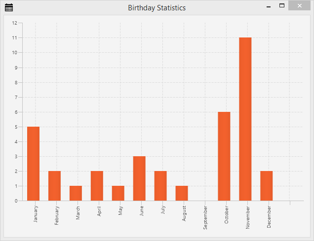
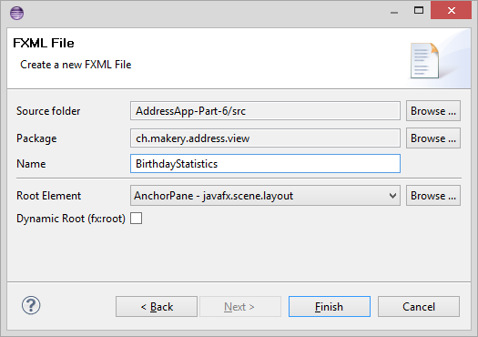

+++
title = "Kısım 6: İstatistik Grafiği"
date = 2018-09-05
description = "JavaFX Sütun Grafiğini nasıl yapacağınızı öğrenin."
image = "addressapp-part6.png"
prettify = true
comments = true
weight = 6

[[sidebars]]
header = "Kaynakları İndir"
[[sidebars.items]]
text = "<i class=\"fa fa-fw fa-download\"></i> Eclipse projesi olarak Kısım 6 <em>(en az JDK 8u40 gerektirir)</em>"
link = "https://github.com/marcojakob/tutorial-javafx-8/releases/download/v1.1/addressapp-jfx8u40-part-6.zip"
+++

## Kısım 6 Başlıkları

* Doğum günü daılımını göstermek için **İstatistik Grafiği** oluşturmak.

*****

## Doğumgünü İstatistiği

Adres uygulamamızdaki tüm kişilerin doğumgünleri var. Kişilerimizin doğum günlerini ne zaman kutladıklarıyla ilgili bir grafik olsa güzel olmaz mıydı? 

Her ay için bir sütun içeren **Sütun Grafiği** kullanacağız. Hersütun o ay içerisindekaç kişinin doğum günü olduğunu gösterecek. 

## Statistics FXML Görünümü

1. `ch.makery.address.view` paketimiz içerisinde `BirthdayStatistics.fxml` oluşturarak başlayacağız  (*pakete sağ tıkla | New | other... | New FXML Document*).   

2. `BirthdayStatistics.fxml` dosyasını Scene Builder ile aç. 

3. Kök `AnchorPane`'i seç. *Layout* grubunda *Pref Width* 620, *Pref Height* 450 olarak ayarla.  

4. `AnchorPane`'e `BarChart` ekle.

5. `BarChart`'a sağ tıkla ve *Fit to Parent* seç. 

6. fxml dosyasını kaydet, Eclipse geri dön ve projeyi yenile. 

Scene Builder'a geri dönmeden önce ilk olarak controller oluşturacağız ve `MainApp` içerisindeki her şeyin bağlantısını yapacağız. 

## Statistics Controller

`ch.makery.address.view` görünüm paketinde `BirthdayStatisticsController.java` isminde bir Java sınıfı oluşturun. 

Açıklamaya başlamadan önce controller sınıfının tamamına bir bakalım: 

##### BirthdayStatisticsController.java

<pre class="prettyprint lang-java">
package ch.makery.address.view;

import java.text.DateFormatSymbols;
import java.util.Arrays;
import java.util.List;
import java.util.Locale;

import javafx.collections.FXCollections;
import javafx.collections.ObservableList;
import javafx.fxml.FXML;
import javafx.scene.chart.BarChart;
import javafx.scene.chart.CategoryAxis;
import javafx.scene.chart.XYChart;
import ch.makery.address.model.Person;

/**
 * The controller for the birthday statistics view.
 * 
 * @author Marco Jakob
 */
public class BirthdayStatisticsController {

    @FXML
    private BarChart&lt;String, Integer> barChart;

    @FXML
    private CategoryAxis xAxis;

    private ObservableList&lt;String> monthNames = FXCollections.observableArrayList();

    /**
     * Initializes the controller class. This method is automatically called
     * after the fxml file has been loaded.
     */
    @FXML
    private void initialize() {
        // Get an array with the English month names.
        String[] months = DateFormatSymbols.getInstance(Locale.ENGLISH).getMonths();
        // Convert it to a list and add it to our ObservableList of months.
        monthNames.addAll(Arrays.asList(months));
        
        // Assign the month names as categories for the horizontal axis.
        xAxis.setCategories(monthNames);
    }

    /**
     * Sets the persons to show the statistics for.
     * 
     * @param persons
     */
    public void setPersonData(List&lt;Person> persons) {
    	// Count the number of people having their birthday in a specific month.
        int[] monthCounter = new int[12];
        for (Person p : persons) {
            int month = p.getBirthday().getMonthValue() - 1;
            monthCounter[month]++;
        }

        XYChart.Series&lt;String, Integer> series = new XYChart.Series&lt;>();
        
        // Create a XYChart.Data object for each month. Add it to the series.
        for (int i = 0; i &lt; monthCounter.length; i++) {
        	series.getData().add(new XYChart.Data&lt;>(monthNames.get(i), monthCounter[i]));
        }
        
        barChart.getData().add(series);
    }
}
</pre>

#### Controller Nasıl Çalışıyor

1. Controller'ın FXML dosyası içerisindeki iki unsura erişmesi lazım: 
   * `barChart`: `String` ve `Integer` tipleri var.  `String` x eksenindeki ay için kullanılıyor ve `Integer` o aydaki kişi sayısı için kullanılıyor. 
   * `xAxis`: Bunu ay Stringleri eklemek iiçn kullanacağız. 

2. `initialize()` metodu x-eksenini tüm aylarla doldurur. 

3. `setPersonData(...)` metoduna `MainApp` sınıfı tarafından kişi verilerini ayarlamak için erişilir. Tüm kişiler üzerinde döner ve her ay için doğum günlerini sayar. Sonra her ay için veri serisine `XYChart.Data` ekler. Her `XYChart.Data` grafikteki bir sütunu temsil eder. 

*****

## Görünüm ile Controller'ı Bağlamak

1. `BirthdayStatistics.fxml`'i Scene Builder ile aç. 

2. *Controller* içerisinde `BirthdayStatisticsController`'ı controller olarak ayarla. 

3. `BarChart`'ı seç ve fx:id Property (*Code* grup içerisinde) olarak `barChart` seç.

4. `CategoryAxis`'i seç ve fx:id Property olarak `xAxis`'i seç.  

5. Daha fazla biçimlendirme için `BarChart`'a (*Properties* grup içerisinde) başlık ekleyebilirsin.

*****

## Görünüm/Controller'ı MainApp te Bağlamak

*birthday statistics* için *edit person dialog*'ta kullandığımız mekanizmanın aynısını kullanacağız; basit bir popup dialog. 

`MainApp` sınıfınıza aşağıdaki metodu ekleyin: 

<pre class="prettyprint lang-java">
/**
 * Opens a dialog to show birthday statistics.
 */
public void showBirthdayStatistics() {
    try {
        // Load the fxml file and create a new stage for the popup.
        FXMLLoader loader = new FXMLLoader();
        loader.setLocation(MainApp.class.getResource("view/BirthdayStatistics.fxml"));
        AnchorPane page = (AnchorPane) loader.load();
        Stage dialogStage = new Stage();
        dialogStage.setTitle("Birthday Statistics");
        dialogStage.initModality(Modality.WINDOW_MODAL);
        dialogStage.initOwner(primaryStage);
        Scene scene = new Scene(page);
        dialogStage.setScene(scene);

        // Set the persons into the controller.
        BirthdayStatisticsController controller = loader.getController();
        controller.setPersonData(personData);

        dialogStage.show();

    } catch (IOException e) {
        e.printStackTrace();
    }
}
</pre>

Herşey ayarlandı, ancak yeni `showBirthdayStatistics()` metodunu çağıran herhangi birşeyimiz yok. Şanslıyız ki `RootLayout.fxml`'de bu maksatla kullanacabileceğimiz bir menü var.

### Doğum Günü İstatistiğini Göster Menüsü

`RootLayoutController`'ınıza *doğum günü istatistiklerini göster* menü maddesine kullanıcı tıklamalarını yönetecek aşağıdaki metodu ekleyin: 

<pre class="prettyprint lang-java">
/**
 * Doğum günü istatistiklerini açar.
 */
@FXML
private void handleShowBirthdayStatistics() {
  mainApp.showBirthdayStatistics();
}
</pre>

Şimdi Scene Builder ile `RootLayout.fxml`'i açın. *Show Statistics* `MenuItem`i olan *Statistics* `Menu`sü oluşturun:

*Show Statistics* `MenuItem`'ı seçin ve `On Action` (*Code* grup içerisinde) için `handleShowBirthdayStatistics`'i seçin. 

Eclipse gidin, projenizi yenileyin ve **test edin**.

*****

## JavaFX Grafikleri Hakkınfa Daha Fazla Bilgi İçin

Daha fazla bilgi için iyi bir kaynak resmi Oracle tutorial [Working with JavaFX Charts](http://docs.oracle.com/javase/8/javafx/user-interface-tutorial/charts.htm).

### Sırada Ne Var?

Son tutorial'da [Kısım 7](/tr/library/javafx-tutorial/part7/) nihayet uygulamamızı dağıtacağız ( yani uygulamamızı paketleyip kullanıcılara ileteceğiz).

##### İlginç bulabileceğiniz diğer bazı makaleler

* [JavaFX Dialogs (official)](/blog/javafx-dialogs-official/)
* [JavaFX Date Picker](/blog/javafx-8-date-picker/)
* [JavaFX Event Handling Examples](/blog/javafx-8-event-handling-examples/)
* [JavaFX TableView Sorting and Filtering](/blog/javafx-8-tableview-sorting-filtering/)
* [JavaFX TableView Cell Renderer](/blog/javafx-8-tableview-cell-renderer/)
